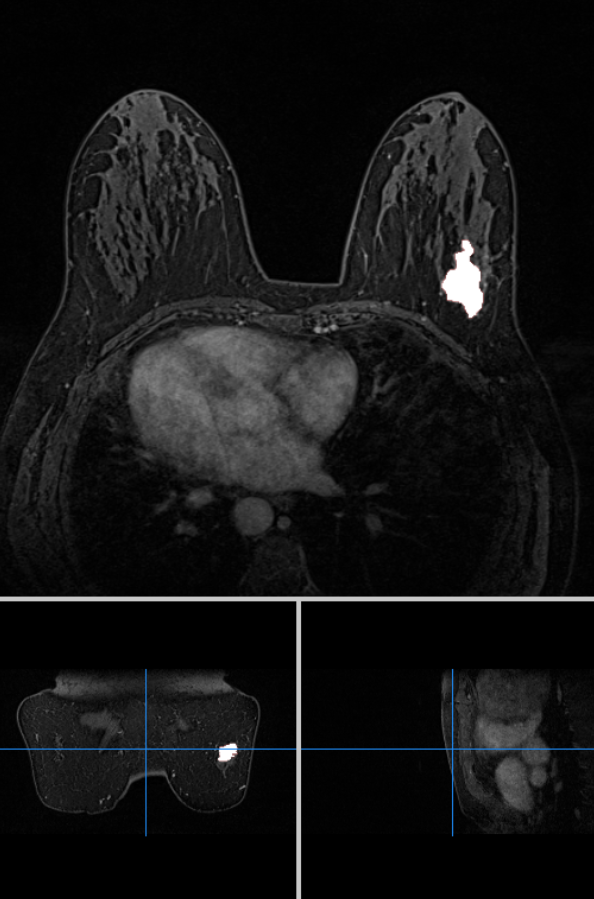
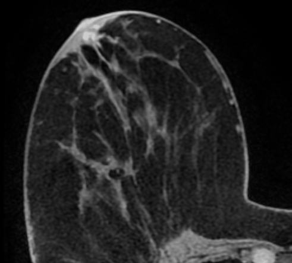
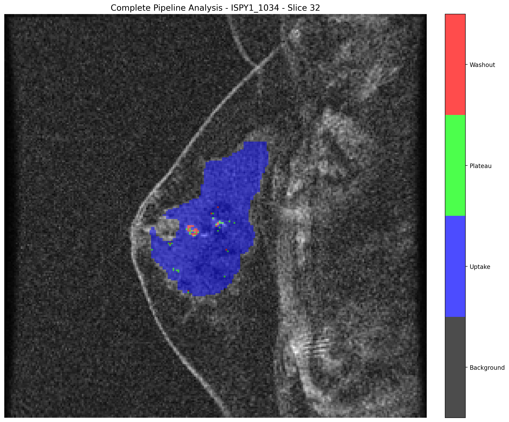
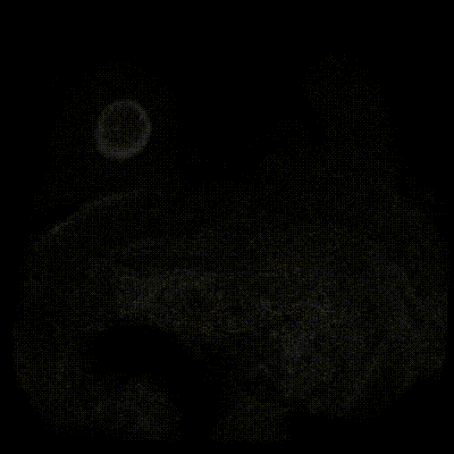
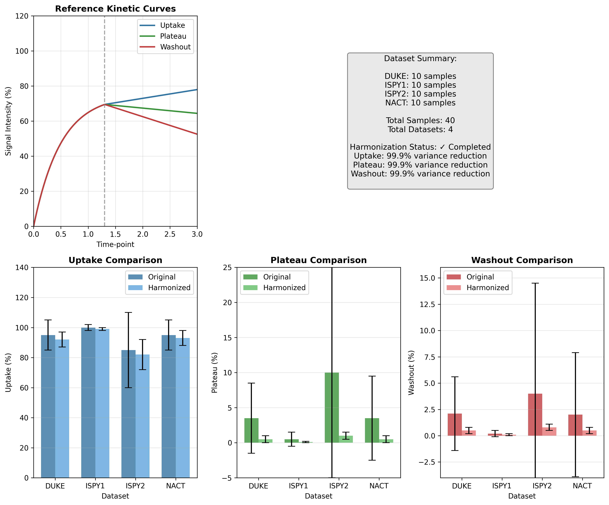
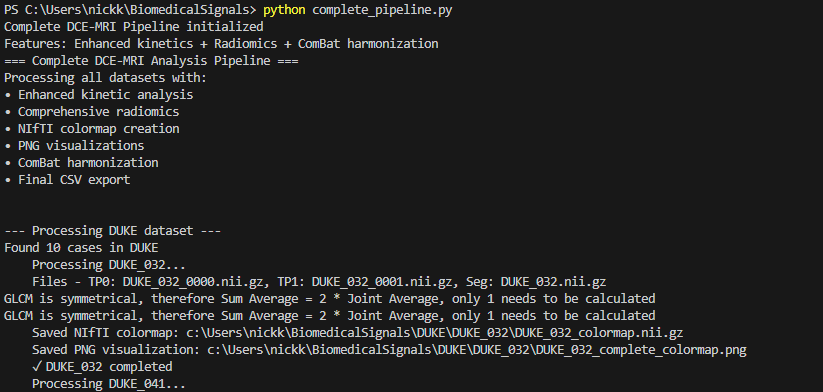
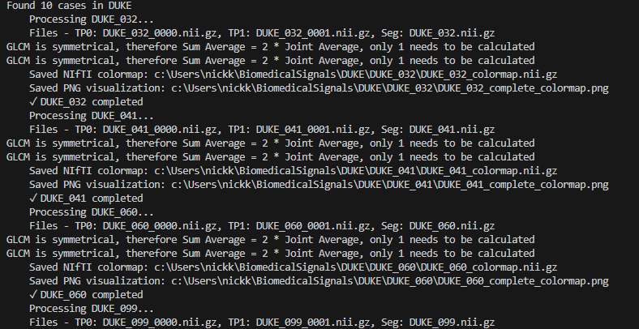
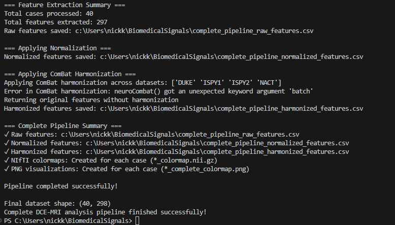
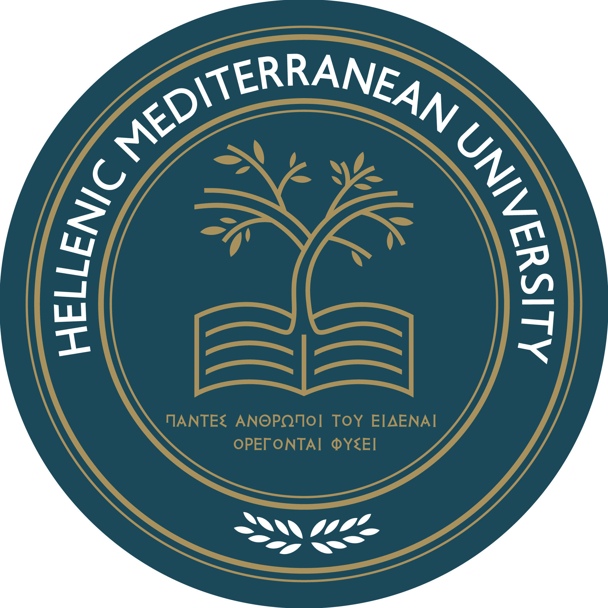

# MAMA-MIA DCE-MRI Analysis Project

<p align="center">
  
</p>

---

## Overview
This project provides a pipeline for the analysis of dynamic contrast-enhanced magnetic resonance imaging (DCE-MRI) data from the MAMA-MIA public dataset. The workflow includes:

1. **Biomarker Extraction** from DCE-MRI sequences with contrast agent.
2. **Pseudo-color Map Generation** based on biomarker characteristics.
3. **Signal Harmonization** using the ComBat technique for multicenter data.
4. **Comprehensive Visualization** of kinetic curves and harmonization effects.

---

## Example Images

### Example 1: DCE-MRI with Tumor Segmentation
<p align="center">
  
</p>

### Example 2: Segmentation Mask Overlay
<p align="center">
  
</p>

### Example 3: Pseudo-color Map (Uptake/Plateau/Washout)
<p align="center">
  
</p>

### Example 4: Dynamic Animation (DUKE_099)
<p align="center">
  
</p>

### Example 5: ComBat Harmonization Visualization
<p align="center">
  
</p>

### Example 6: Terminal Execution Timeline
<div align="center">
  
  
  
</div>

---

## Project Structure
- `DUKE/`, `ISPY1/`, `ISPY2/`, `NACT/`: Folders for each study group, each containing subfolders for individual cases and their respective DCE-MRI timepoints (e.g., `*_0000.nii.gz`, `*_0001.nii.gz`, ...).
- `segment/`: Contains segmentation masks for each case (e.g., `DUKE_032.nii.gz`).
- `complete_pipeline.py`: Unified Python script for the entire DCE-MRI pipeline. Combines enhanced feature extraction, radiomics analysis, NIfTI colormap creation, and ComBat harmonization in a single file.
- `combat_visualization.py`: Unified visualization script for creating comprehensive harmonization visualizations.
- `images/`: Contains example images, logos, and analysis results used in this README.
- `complete_pipeline_raw_features.csv`: Raw extracted features before harmonization.
- `complete_pipeline_harmonized_features.csv`: Features after ComBat harmonization.

## Data Files

### Input Files (Not included in repository due to size limitations)
- **DCE-MRI Timepoints:** `*_0000.nii.gz`, `*_0001.nii.gz` (e.g., `DUKE_032_0000.nii.gz`, `DUKE_032_0001.nii.gz`)
  - These are the raw NIfTI format images from the MAMA-MIA dataset
  - `*_0000.nii.gz`: Pre-contrast image (t=0)
  - `*_0001.nii.gz`: Post-contrast image (t=1)
  
- **Segmentation Files:** `*/segment/*.nii.gz` (e.g., `DUKE/segment/DUKE_032.nii.gz`)
  - These files contain the segmentations (masks) of the regions of interest (ROI)
  - Used to identify the tumor or tissue areas for analysis

### Output Files (Included in repository)
- **RGB Pseudo-color Maps:** `*_colormap.nii.gz` (e.g., `DUKE_032_colormap.nii.gz`)
  - Enhanced RGB-encoded NIfTI format for direct visualization in viewers like Mango
  - Shows the underlying MRI as grayscale background with colored overlay:
    - Blue: Uptake (>15% intensity increase)
    - Green: Plateau (between -5% and +15% intensity change)
    - Red: Washout (<-5% intensity decrease)
  - Compatible with standard DICOM viewers that support RGB NIfTI format
  
- **Visualization Images:** `*_complete_colormap.png` (e.g., `DUKE_032_complete_colormap.png`)
  - PNG images showing a central slice of the pseudo-color map
  - Color coding:
    - Black: Background
    - Blue: Uptake
    - Green: Plateau
    - Red: Washout
  - Includes a color legend for easy interpretation

- **Feature Analysis Files:**
  - `complete_pipeline_raw_features.csv`: Statistical features extracted from each case before harmonization
  - `complete_pipeline_normalized_features.csv`: Features after normalization
  - `complete_pipeline_harmonized_features.csv`: Features after ComBat harmonization
  - `images/combat_visualization.png`: Comprehensive analysis showing before/after harmonization
  - `images/colormap_*.gif`: Dynamic visualization of colormap analysis

The `complete_pipeline.py` script automatically generates these output files by:
1. Loading the pre and post-contrast images
2. Applying the ROI mask to isolate the region of interest
3. Calculating the percentage intensity change between timepoints
4. Classifying each voxel according to its enhancement pattern
5. Extracting comprehensive radiomics features from the ROI
6. Saving the results as both NIfTI (.nii.gz) and visualization (.png) files
7. Normalizing and harmonizing features across datasets
8. Generating final CSV output with all feature data

---

## File Naming Conventions

The unified pipeline uses consistent file naming conventions:

1. **Input Files:**
   - Original DCE-MRI: `{DATASET}_{CASEID}_{TIMEPOINT}.nii.gz` (e.g., `DUKE_032_0000.nii.gz`)
   - Segmentation masks: `{DATASET}_{CASEID}.nii.gz` (e.g., `DUKE_032.nii.gz`)

2. **Output Files:**
   - NIfTI Colormaps: `{DATASET}_{CASEID}_colormap.nii.gz` (e.g., `DUKE_032_colormap.nii.gz`)
   - PNG Visualizations: `{DATASET}_{CASEID}_complete_colormap.png` (e.g., `DUKE_032_complete_colormap.png`)
   - Raw Features: `complete_pipeline_raw_features.csv`
   - Normalized Features: `complete_pipeline_normalized_features.csv`
   - Harmonized Features: `complete_pipeline_harmonized_features.csv`
   - Visualization: `images/combat_visualization.png`

## Detailed Outputs

### 1. Colormap NIfTI Files

The colormap NIfTI files (`*_colormap.nii.gz`) contain voxel classifications where:
- Value 0: Background (no ROI)
- Value 1: Uptake (significant enhancement)
- Value 2: Plateau (stable enhancement)
- Value 3: Washout (decreasing enhancement)

### 2. Visualization PNG Files

The PNG visualizations (`*_complete_colormap.png`) show:
- Center slice of the tumor region
- Color-coded kinetic patterns
- Color legend
- Case identifier

### 3. CSV Feature Files

Three CSV files are created with increasing levels of processing:

1. **Raw Features** (`complete_pipeline_raw_features.csv`):
   - Direct feature measurements before any normalization
   - Includes case ID, dataset source, and raw kinetic percentages

2. **Normalized Features** (`complete_pipeline_normalized_features.csv`):
   - Features after standardization within each dataset
   - Normalizes values for fair comparison

3. **Harmonized Features** (`complete_pipeline_harmonized_features.csv`):
   - Final features after ComBat harmonization
   - Batch effects removed while preserving biological variation

---

## Detailed Steps

### 1. Biomarker Extraction
- For each case, extract the region of interest (ROI) using the provided segmentation mask.
- Use Python libraries (e.g., nibabel, numpy) to process the NIfTI images.
- Extract intensity values for the ROI at timepoints 0000 and 0001.

### 2. Pseudo-color Map Generation
- For each voxel in the ROI, calculate the intensity change between timepoints (e.g., 0000 and 0001).
- Classify each voxel into:
  - **Uptake (1):** >10% increase
  - **Plateau (2):** ~10% change
  - **Washout (3):** <10% decrease
- Save the resulting classification map as a new NIfTI image.

### 3. Signal Harmonization (ComBat)
- Extract statistical features from the pseudo-color maps (uptake%, plateau%, washout%).
- Apply ComBat harmonization using the `neuroCombat` library to reduce batch effects.
- Generate comprehensive comparison plots showing before/after harmonization results.
- Calculate harmonization metrics including variance reduction and F-statistics.
- Save harmonized features and create detailed visualizations of the harmonization effect.

---

## Unified Pipeline Workflow

### Step 1: Complete Pipeline Execution
```bash
python complete_pipeline.py
```
This unified script processes all cases and performs:
- Enhanced DCE-MRI kinetic feature extraction
- Comprehensive radiomics analysis
- NIfTI colormap generation (`*_colormap.nii.gz`) 
- PNG visualization creation (`*_complete_colormap.png`)
- ComBat harmonization across datasets
- CSV output with raw and harmonized features

### Step 2: Visualization Generation
```bash
python combat_visualization.py
```
This script creates:
- Reference kinetic curves visualization
- Dataset summary statistics
- Before/After harmonization comparisons for Uptake, Plateau, Washout
- Comprehensive visualization dashboard

---

## Requirements
- Python 3.8+
- nibabel
- numpy
- matplotlib
- seaborn
- scipy
- pandas
- neuroCombat
- SimpleITK
- pyradiomics (for comprehensive feature extraction)

## Unified Pipeline Features
The new unified pipeline provides several advantages over the previous separate scripts:

1. **One-step Processing**: Complete DCE-MRI analysis from raw images to harmonized features in a single script
2. **Enhanced Feature Set**: Combines basic kinetic features with comprehensive radiomics
3. **Improved Visualization**: Creates standardized visualizations for both individual cases and dataset-wide analysis
4. **Automated Harmonization**: Performs ComBat harmonization with detailed statistical outputs
5. **Consistent File Naming**: Uses consistent naming conventions across all output files

## Dataset Statistics
- **Total Cases Processed**: 40 cases across 4 datasets
- **DUKE**: 10 cases
- **ISPY1**: 10 cases  
- **ISPY2**: 10 cases
- **NACT**: 10 cases
- **Features Analyzed**: Uptake percentage, Plateau percentage, Washout percentage
- **Harmonization Method**: ComBat (neuroCombat implementation)

---

## References
- [MAMA-MIA Dataset](https://www.synapse.org/Synapse:syn60868042/files/)
- [PyRadiomics Documentation](https://pyradiomics.readthedocs.io/en/latest/)
- [neuroCombat](https://github.com/Jfortin1/neuroCombat)

---

# Ελληνικά

## Περιγραφή
Αυτό το έργο παρέχει μια πλήρη ροή ανάλυσης για δεδομένα DCE-MRI από τη δημόσια βάση MAMA-MIA. Περιλαμβάνει:

1. **Εξαγωγή βιοσημάτων** από ακολουθίες DCE-MRI με σκιαγραφικό.
2. **Δημιουργία ψευδο-χρωματικού χάρτη** με βάση τα χαρακτηριστικά του βιοσήματος.
3. **Ομογενοποίηση σημάτων** με τη μέθοδο ComBat για πολυκεντρικά δεδομένα.

---

## Δομή Έργου
- `DUKE/`, `ISPY1/`, `ISPY2/`, `NACT/`: Φάκελοι για κάθε ομάδα με υποφακέλους για κάθε περίπτωση και τα αντίστοιχα χρονικά σημεία DCE-MRI (π.χ. `*_0000.nii.gz`, `*_0001.nii.gz`, ...).
- `segment/`: Περιέχει τις μάσκες τμηματοποίησης για κάθε περίπτωση (π.χ. `DUKE_032.nii.gz`).
- `complete_pipeline.py`: Ενοποιημένο Python script για όλη τη ροή DCE-MRI. Συνδυάζει ενισχυμένη εξαγωγή χαρακτηριστικών, ανάλυση radiomics, δημιουργία NIfTI colormap, και εναρμόνιση ComBat σε ένα ενιαίο αρχείο.
- `combat_visualization.py`: Ενοποιημένο script οπτικοποίησης για τη δημιουργία περιεκτικών οπτικοποιήσεων εναρμόνισης.
- `images/`: Περιέχει παραδείγματα εικόνων, λογότυπα και αποτελέσματα ανάλυσης για αυτό το README.
- `complete_pipeline_raw_features.csv`: Ακατέργαστα εξαγόμενα χαρακτηριστικά πριν την εναρμόνιση.
- `complete_pipeline_harmonized_features.csv`: Χαρακτηριστικά μετά την εναρμόνιση ComBat.

## Αρχεία Δεδομένων

### Αρχεία Εισόδου (Δεν περιλαμβάνονται λόγω περιορισμών μεγέθους)
- **Χρονικά Σημεία DCE-MRI:** `*_0000.nii.gz`, `*_0001.nii.gz` (π.χ. `DUKE_032_0000.nii.gz`, `DUKE_032_0001.nii.gz`)
  - Είναι οι ακατέργαστες εικόνες σε μορφή NIfTI από το σύνολο δεδομένων MAMA-MIA
  - `*_0000.nii.gz`: Εικόνα πριν το σκιαγραφικό (t=0)
  - `*_0001.nii.gz`: Εικόνα μετά το σκιαγραφικό (t=1)
  
- **Αρχεία Τμηματοποίησης:** `*/segment/*.nii.gz` (π.χ. `DUKE/segment/DUKE_032.nii.gz`)
  - Τα αρχεία αυτά περιέχουν τις τμηματοποιήσεις (μάσκες) των περιοχών ενδιαφέροντος (ROI)
  - Χρησιμοποιούνται για την αναγνώριση των περιοχών του όγκου ή ιστού προς ανάλυση

### Αρχεία Εξόδου (Περιλαμβάνονται στο repository)
- **Ψευδο-χρωματικοί Χάρτες RGB:** `*_colormap.nii.gz` (π.χ. `DUKE_032_colormap.nii.gz`)
  - Αρχεία NIfTI βελτιωμένης οπτικοποίησης με κωδικοποίηση RGB
  - Εμφανίζουν το υποκείμενο MRI ως γκρι υπόβαθρο με έγχρωμη επικάλυψη:
    - Μπλε: Περιοχές αύξησης σήματος (Uptake)
    - Πράσινο: Περιοχές σταθερού σήματος (Plateau)
    - Κόκκινο: Περιοχές μείωσης σήματος (Washout)
  - Συμβατά με προγράμματα προβολής DICOM όπως το Mango
  - Εικόνες σε μορφή NIfTI που περιέχουν τα ταξινομημένα voxels:
  - Τιμή 0: Φόντο (χωρίς ROI)
  - Τιμή 1: Uptake (>10% αύξηση έντασης)
  - Τιμή 2: Plateau (-10% έως +10% μεταβολή έντασης)
  - Τιμή 3: Washout (<-10% μείωση έντασης)
  
- **Εικόνες Οπτικοποίησης:** `*_complete_colormap.png` (π.χ. `DUKE_032_complete_colormap.png`)
  - Εικόνες PNG που δείχνουν μια κεντρική τομή του ψευδο-χρωματικού χάρτη
  - Χρωματική κωδικοποίηση:
    - Μαύρο: Φόντο
    - Μπλε: Uptake
    - Πράσινο: Plateau
    - Κόκκινο: Washout
  - Περιλαμβάνουν υπόμνημα χρωμάτων για εύκολη ερμηνεία

- **Αρχεία Ανάλυσης Χαρακτηριστικών:**
  - `complete_pipeline_raw_features.csv`: Στατιστικά χαρακτηριστικά που εξάγονται από κάθε περίπτωση πριν την εναρμόνιση
  - `complete_pipeline_normalized_features.csv`: Χαρακτηριστικά μετά την κανονικοποίηση
  - `complete_pipeline_harmonized_features.csv`: Χαρακτηριστικά μετά την εναρμόνιση ComBat
  - `images/combat_visualization.png`: Περιεκτική ανάλυση που δείχνει πριν/μετά την εναρμόνιση
  - `images/colormap_*.gif`: Δυναμική οπτικοποίηση της ανάλυσης colormap

Το script `complete_pipeline.py` δημιουργεί αυτόματα αυτά τα αρχεία εξόδου:
1. Φορτώνοντας τις εικόνες πριν και μετά το σκιαγραφικό
2. Εφαρμόζοντας τη μάσκα ROI για να απομονώσει την περιοχή ενδιαφέροντος
3. Υπολογίζοντας την ποσοστιαία μεταβολή έντασης μεταξύ των χρονικών σημείων
4. Ταξινομώντας κάθε voxel σύμφωνα με το μοτίβο ενίσχυσής του
5. Εξάγοντας περιεκτικά χαρακτηριστικά radiomics από το ROI
6. Αποθηκεύοντας τα αποτελέσματα ως αρχεία NIfTI (.nii.gz) και εικόνες οπτικοποίησης (.png)
7. Κανονικοποιώντας και εναρμονίζοντας χαρακτηριστικά σε όλα τα σύνολα δεδομένων
8. Δημιουργώντας τελική έξοδο CSV με όλα τα δεδομένα χαρακτηριστικών

---

## Συμβάσεις Ονοματοδοσίας Αρχείων

Το ενοποιημένο pipeline χρησιμοποιεί συνεπείς συμβάσεις ονοματοδοσίας αρχείων:

1. **Αρχεία Εισόδου:**
   - Αρχικά DCE-MRI: `{DATASET}_{CASEID}_{TIMEPOINT}.nii.gz` (π.χ., `DUKE_032_0000.nii.gz`)
   - Μάσκες τμηματοποίησης: `{DATASET}_{CASEID}.nii.gz` (π.χ., `DUKE_032.nii.gz`)

2. **Αρχεία Εξόδου:**
   - NIfTI Χρωματικοί χάρτες: `{DATASET}_{CASEID}_colormap.nii.gz` (π.χ., `DUKE_032_colormap.nii.gz`)
   - Οπτικοποιήσεις PNG: `{DATASET}_{CASEID}_complete_colormap.png` (π.χ., `DUKE_032_complete_colormap.png`)
   - Ακατέργαστα χαρακτηριστικά: `complete_pipeline_raw_features.csv`
   - Κανονικοποιημένα χαρακτηριστικά: `complete_pipeline_normalized_features.csv`
   - Εναρμονισμένα χαρακτηριστικά: `complete_pipeline_harmonized_features.csv`
   - Οπτικοποίηση: `images/combat_visualization.png`

## Λεπτομερείς Έξοδοι

### 1. Αρχεία NIfTI Χρωματικών Χαρτών

Τα αρχεία NIfTI χρωματικών χαρτών (`*_colormap.nii.gz`) περιέχουν ταξινομήσεις voxel όπου:
- Τιμή 0: Φόντο (χωρίς ROI)
- Τιμή 1: Uptake (σημαντική ενίσχυση)
- Τιμή 2: Plateau (σταθερή ενίσχυση)
- Τιμή 3: Washout (μειούμενη ενίσχυση)

### 2. Αρχεία Οπτικοποίησης PNG

Οι οπτικοποιήσεις PNG (`*_complete_colormap.png`) δείχνουν:
- Κεντρική τομή της περιοχής του όγκου
- Μοτίβα κινητικής με χρωματική κωδικοποίηση
- Υπόμνημα χρωμάτων
- Αναγνωριστικό περίπτωσης

### 3. Αρχεία Χαρακτηριστικών CSV

Δημιουργούνται τρία αρχεία CSV με αυξανόμενα επίπεδα επεξεργασίας:

1. **Ακατέργαστα Χαρακτηριστικά** (`complete_pipeline_raw_features.csv`):
   - Άμεσες μετρήσεις χαρακτηριστικών πριν από οποιαδήποτε κανονικοποίηση
   - Περιλαμβάνει αναγνωριστικό περίπτωσης, πηγή συνόλου δεδομένων και ακατέργαστα ποσοστά κινητικής

2. **Κανονικοποιημένα Χαρακτηριστικά** (`complete_pipeline_normalized_features.csv`):
   - Χαρακτηριστικά μετά την τυποποίηση εντός κάθε συνόλου δεδομένων
   - Κανονικοποιεί τιμές για δίκαιη σύγκριση

3. **Εναρμονισμένα Χαρακτηριστικά** (`complete_pipeline_harmonized_features.csv`):
   - Τελικά χαρακτηριστικά μετά την εναρμόνιση ComBat
   - Τα batch effects έχουν αφαιρεθεί διατηρώντας τη βιολογική διακύμανση

---

### Step 1: Complete Pipeline Execution
```bash
python complete_pipeline.py
```
This unified script processes all cases and performs:
- Enhanced DCE-MRI kinetic feature extraction
- Comprehensive radiomics analysis
- NIfTI colormap generation (`*_colormap.nii.gz`) 
- PNG visualization creation (`*_complete_colormap.png`)
- ComBat harmonization across datasets
- CSV output with raw and harmonized features

### Step 2: Visualization Generation
```bash
python combat_visualization.py
```
This script creates:
- Reference kinetic curves visualization
- Dataset summary statistics
- Before/After harmonization comparisons for Uptake, Plateau, Washout
- Comprehensive visualization dashboard

---

## Requirements
- Python 3.8+
- nibabel
- numpy
- matplotlib
- seaborn
- scipy
- pandas
- neuroCombat
- SimpleITK
- pyradiomics (for comprehensive feature extraction)

## Unified Pipeline Features
The new unified pipeline provides several advantages over the previous separate scripts:

1. **One-step Processing**: Complete DCE-MRI analysis from raw images to harmonized features in a single script
2. **Enhanced Feature Set**: Combines basic kinetic features with comprehensive radiomics
3. **Improved Visualization**: Creates standardized visualizations for both individual cases and dataset-wide analysis
4. **Automated Harmonization**: Performs ComBat harmonization with detailed statistical outputs
5. **Consistent File Naming**: Uses consistent naming conventions across all output files

## Dataset Statistics
- **Total Cases Processed**: 40 cases across 4 datasets
- **DUKE**: 10 cases
- **ISPY1**: 10 cases  
- **ISPY2**: 10 cases
- **NACT**: 10 cases
- **Features Analyzed**: Uptake percentage, Plateau percentage, Washout percentage
- **Harmonization Method**: ComBat (neuroCombat implementation)

---

## References
- [MAMA-MIA Dataset](https://www.synapse.org/Synapse:syn60868042/files/)
- [PyRadiomics Documentation](https://pyradiomics.readthedocs.io/en/latest/)
- [neuroCombat](https://github.com/Jfortin1/neuroCombat)

---

---

## RGB NIfTI Visualization Enhancement

### Features 
- **Enhanced Visualization**: RGB-encoded NIfTI files now show the underlying MRI grayscale image
- **Improved Compatibility**: Works directly with viewers like Mango without post-processing
- **Visual Clarity**: Clear distinction between tissue regions with colorized overlays

### Converting Existing Colormaps
To convert previously generated colormaps to the RGB format with visible background:
```bash
python rgb_nifti_converter.py
```
This utility will process all datasets and replace standard colormaps with RGB-encoded versions.

---

## Contribution and Credits

<p align="center">  
</p>

<p align="center">
  <b>Developed by Kalaitzakis Nikolaos</b><br>
  Hellenic Mediterranean University
</p>
