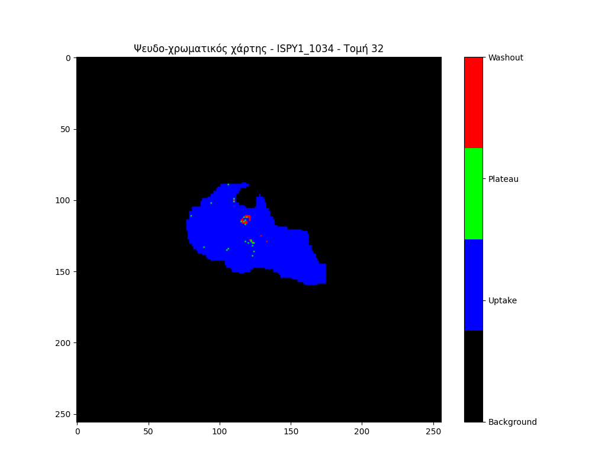

# MAMA-MIA DCE-MRI Analysis Project

<p align="center">
  
</p>

---

## Overview
This project provides a complete pipeline for the analysis of dynamic contrast-enhanced magnetic resonance imaging (DCE-MRI) data from the MAMA-MIA public dataset. The workflow includes:

1. **Biomarker Extraction** from DCE-MRI sequences with contrast agent.
2. **Pseudo-color Map Generation** based on biomarker characteristics.
3. **Signal Harmonization** using the ComBat technique for multicenter data.

---

## Example Images

### Example 1: DCE-MRI with Tumor Segmentation
<p align="center">
  
</p>

### Example 2: Segmentation Mask Overlay
<p align="center">
  
</p>

### Example 3: Pseudo-color Map (Uptake/Plateau/Washout)
<p align="center">
  
</p>

### Example 4: Dynamic Colormap Animation (DUKE_099)
<p align="center">
  
</p>

### Example 5: ComBat Harmonization Analysis
<p align="center">
  
</p>

### Example 6: Feature-Specific Harmonization Results
<div align="center">
  
  
  
</div>

---

## Project Structure
- `DUKE/`, `ISPY1/`, `ISPY2/`, `NACT/`: Folders for each study group, each containing subfolders for individual cases and their respective DCE-MRI timepoints (e.g., `*_0000.nii.gz`, `*_0001.nii.gz`, ...).
- `segment/`: Contains segmentation masks for each case (e.g., `DUKE_032.nii.gz`).
- `process_all_data.py`: Main Python script for generating pseudo-color maps from the DCE-MRI data.
- `harmonize_signals.py`: ComBat harmonization pipeline for multicenter data harmonization.
- `images/`: Contains example images, logos, and analysis results used in this README.
- `raw_features.csv`: Raw extracted features before harmonization.
- `harmonized_features.csv`: Features after ComBat harmonization.

## Data Files

### Input Files (Not included in repository due to size limitations)
- **DCE-MRI Timepoints:** `*_0000.nii.gz`, `*_0001.nii.gz` (e.g., `DUKE_032_0000.nii.gz`, `DUKE_032_0001.nii.gz`)
  - These are the raw NIfTI format images from the MAMA-MIA dataset
  - `*_0000.nii.gz`: Pre-contrast image (t=0)
  - `*_0001.nii.gz`: Post-contrast image (t=1)
  
- **Segmentation Files:** `*/segment/*.nii.gz` (e.g., `DUKE/segment/DUKE_032.nii.gz`)
  - These files contain the segmentations (masks) of the regions of interest (ROI)
  - Used to identify the tumor or tissue areas for analysis

### Output Files (Included in repository)
- **Pseudo-color Maps:** `*_colormap.nii.gz` (e.g., `DUKE_032_colormap.nii.gz`)
  - NIfTI format images containing the classified voxels:
  - Value 0: Background (no ROI)
  - Value 1: Uptake (>10% intensity increase)
  - Value 2: Plateau (-10% to +10% intensity change)
  - Value 3: Washout (<-10% intensity decrease)
  
- **Visualization Images:** `*_colormap_slice.png` (e.g., `DUKE_032_colormap_slice.png`)
  - PNG images showing a central slice of the pseudo-color map
  - Color coding:
    - Black: Background
    - Blue: Uptake
    - Green: Plateau
    - Red: Washout
  - Includes a color legend for easy interpretation

- **Feature Analysis Files:**
  - `raw_features.csv`: Statistical features extracted from each case before harmonization
  - `harmonized_features.csv`: Features after ComBat harmonization
  - `images/comprehensive_combat_analysis.png`: Comprehensive analysis showing before/after harmonization
  - `images/combat_pct_*.png`: Individual feature comparison plots
  - `images/colomap_*.gif`: Dynamic visualization of colormap analysis

The `process_all_data.py` script automatically generates these output files by:
1. Loading the pre and post-contrast images
2. Applying the ROI mask to isolate the region of interest
3. Calculating the percentage intensity change between timepoints
4. Classifying each voxel according to its enhancement pattern
5. Saving the results as both NIfTI (.nii.gz) and visualization (.png) files

---

## Detailed Steps

### 1. Biomarker Extraction
- For each case, extract the region of interest (ROI) using the provided segmentation mask.
- Use Python libraries (e.g., nibabel, numpy) to process the NIfTI images.
- Extract intensity values for the ROI at timepoints 0000 and 0001.

### 2. Pseudo-color Map Generation
- For each voxel in the ROI, calculate the intensity change between timepoints (e.g., 0000 and 0001).
- Classify each voxel into:
  - **Uptake (1):** >10% increase
  - **Plateau (2):** ~10% change
  - **Washout (3):** <10% decrease
- Save the resulting classification map as a new NIfTI image.

### 3. Signal Harmonization (ComBat)
- Extract statistical features from the pseudo-color maps (uptake%, plateau%, washout%).
- Apply ComBat harmonization using the `neuroCombat` library to reduce batch effects.
- Generate comprehensive comparison plots showing before/after harmonization results.
- Calculate harmonization metrics including variance reduction and F-statistics.
- Save harmonized features and create detailed visualizations of the harmonization effect.

---

## Complete Pipeline Workflow

### Step 1: Pseudo-color Map Generation
```bash
python process_all_data.py
```
This script processes all cases and generates:
- `*_colormap.nii.gz` files with classified voxels
- `*_colormap_slice.png` visualization images

### Step 2: Feature Extraction and Harmonization
```bash
python harmonize_signals.py
```
This script performs:
- Feature extraction from colormap files
- ComBat harmonization across datasets
- Statistical analysis and visualization generation
- Creation of comprehensive comparison plots

---

## Usage
1. Download the MAMA-MIA dataset from [Synapse](https://www.synapse.org/Synapse:syn60868042/files/).
2. Place the data in the corresponding folders as shown above.
3. Install required Python packages:
   ```bash
   pip install nibabel numpy matplotlib SimpleITK pandas seaborn scipy neuroCombat
   ```
4. **Step 1 - Generate pseudo-color maps:**
   ```bash
   python process_all_data.py
   ```
   This creates:
   - `*_colormap.nii.gz` - NIfTI files with classified voxels
   - `*_colormap_slice.png` - PNG visualization images

5. **Step 2 - Run ComBat harmonization:**
   ```bash
   python harmonize_signals.py
   ```
   This generates:
   - `raw_features.csv` - Features before harmonization
   - `harmonized_features.csv` - Features after harmonization
   - Comprehensive analysis plots in the `images/` folder

6. **View Results:**
   - NIfTI files can be visualized using [Mango Viewer](https://mangoviewer.com/) or similar tools
   - Analysis plots are automatically saved in the `images/` folder
   - Statistical summaries are printed to the console during execution

**Note**: Due to the large size of the NIfTI input files (`*_0000.nii.gz`, `*_0001.nii.gz`), they are not included in this repository. However, the processed output files (`*_colormap.nii.gz` and `*_colormap_slice.png`) are included for reference.

---

## Requirements
- Python 3.8+
- nibabel
- numpy
- matplotlib
- seaborn
- scipy
- pandas
- neuroCombat
- SimpleITK (optional, for advanced processing)
- PyRadiomics (optional, for extended radiomic features)

## Dataset Statistics
- **Total Cases Processed**: 40 cases across 4 datasets
- **DUKE**: 10 cases
- **ISPY1**: 10 cases  
- **ISPY2**: 10 cases
- **NACT**: 10 cases
- **Features Analyzed**: Uptake percentage, Plateau percentage, Washout percentage
- **Harmonization Method**: ComBat (neuroCombat implementation)

---

## References
- [MAMA-MIA Dataset](https://www.synapse.org/Synapse:syn60868042/files/)
- [PyRadiomics Documentation](https://pyradiomics.readthedocs.io/en/latest/)
- [neuroCombat](https://github.com/Jfortin1/neuroCombat)

---

# Ελληνικά

## Περιγραφή
Αυτό το έργο παρέχει μια πλήρη ροή ανάλυσης για δεδομένα DCE-MRI από τη δημόσια βάση MAMA-MIA. Περιλαμβάνει:

1. **Εξαγωγή βιοσημάτων** από ακολουθίες DCE-MRI με σκιαγραφικό.
2. **Δημιουργία ψευδο-χρωματικού χάρτη** με βάση τα χαρακτηριστικά του βιοσήματος.
3. **Ομογενοποίηση σημάτων** με τη μέθοδο ComBat για πολυκεντρικά δεδομένα.

---

## Δομή Έργου
- `DUKE/`, `ISPY1/`, `ISPY2/`, `NACT/`: Φάκελοι για κάθε ομάδα με υποφακέλους για κάθε περίπτωση και τα αντίστοιχα χρονικά σημεία DCE-MRI (π.χ. `*_0000.nii.gz`, `*_0001.nii.gz`, ...).
- `segment/`: Περιέχει τις μάσκες τμηματοποίησης για κάθε περίπτωση (π.χ. `DUKE_032.nii.gz`).
- `process_all_data.py`: Κύριο Python script για τη δημιουργία ψευδο-χρωματικών χαρτών από τα δεδομένα DCE-MRI.
- `harmonize_signals.py`: Pipeline ComBat εναρμόνισης για εναρμόνιση πολυκεντρικών δεδομένων.
- `images/`: Περιέχει παραδείγματα εικόνων, λογότυπα και αποτελέσματα ανάλυσης για αυτό το README.
- `raw_features.csv`: Ακατέργαστα εξαγόμενα χαρακτηριστικά πριν την εναρμόνιση.
- `harmonized_features.csv`: Χαρακτηριστικά μετά την εναρμόνιση ComBat.

## Αρχεία Δεδομένων

### Αρχεία Εισόδου (Δεν περιλαμβάνονται στο αποθετήριο λόγω περιορισμών μεγέθους)
- **Χρονικά Σημεία DCE-MRI:** `*_0000.nii.gz`, `*_0001.nii.gz` (π.χ. `DUKE_032_0000.nii.gz`, `DUKE_032_0001.nii.gz`)
  - Είναι οι ακατέργαστες εικόνες σε μορφή NIfTI από το σύνολο δεδομένων MAMA-MIA
  - `*_0000.nii.gz`: Εικόνα πριν το σκιαγραφικό (t=0)
  - `*_0001.nii.gz`: Εικόνα μετά το σκιαγραφικό (t=1)
  
- **Αρχεία Τμηματοποίησης:** `*/segment/*.nii.gz` (π.χ. `DUKE/segment/DUKE_032.nii.gz`)
  - Τα αρχεία αυτά περιέχουν τις τμηματοποιήσεις (μάσκες) των περιοχών ενδιαφέροντος (ROI)
  - Χρησιμοποιούνται για την αναγνώριση των περιοχών του όγκου ή ιστού προς ανάλυση

### Αρχεία Εξόδου (Περιλαμβάνονται στο αποθετήριο)
- **Ψευδο-χρωματικοί Χάρτες:** `*_colormap.nii.gz` (π.χ. `DUKE_032_colormap.nii.gz`)
  - Εικόνες σε μορφή NIfTI που περιέχουν τα ταξινομημένα voxels:
  - Τιμή 0: Φόντο (χωρίς ROI)
  - Τιμή 1: Uptake (>10% αύξηση έντασης)
  - Τιμή 2: Plateau (-10% έως +10% μεταβολή έντασης)
  - Τιμή 3: Washout (<-10% μείωση έντασης)
  
- **Εικόνες Οπτικοποίησης:** `*_colormap_slice.png` (π.χ. `DUKE_032_colormap_slice.png`)
  - Εικόνες PNG που δείχνουν μια κεντρική τομή του ψευδο-χρωματικού χάρτη
  - Χρωματική κωδικοποίηση:
    - Μαύρο: Φόντο
    - Μπλε: Uptake
    - Πράσινο: Plateau
    - Κόκκινο: Washout  - Περιλαμβάνουν υπόμνημα χρωμάτων για εύκολη ερμηνεία

- **Αρχεία Ανάλυσης Χαρακτηριστικών:**
  - `raw_features.csv`: Στατιστικά χαρακτηριστικά που εξάγονται από κάθε περίπτωση πριν την εναρμόνιση
  - `harmonized_features.csv`: Χαρακτηριστικά μετά την εναρμόνιση ComBat
  - `images/comprehensive_combat_analysis.png`: Περιεκτική ανάλυση που δείχνει πριν/μετά την εναρμόνιση
  - `images/combat_pct_*.png`: Γραφήματα σύγκρισης μεμονωμένων χαρακτηριστικών
  - `images/colomap_*.gif`: Δυναμική οπτικοποίηση της ανάλυσης colormap

Το script `process_all_data.py` δημιουργεί αυτόματα αυτά τα αρχεία εξόδου:
1. Φορτώνοντας τις εικόνες πριν και μετά το σκιαγραφικό
2. Εφαρμόζοντας τη μάσκα ROI για να απομονώσει την περιοχή ενδιαφέροντος
3. Υπολογίζοντας την ποσοστιαία μεταβολή έντασης μεταξύ των χρονικών σημείων
4. Ταξινομώντας κάθε voxel σύμφωνα με το μοτίβο ενίσχυσής του
5. Αποθηκεύοντας τα αποτελέσματα ως αρχεία NIfTI (.nii.gz) και εικόνες οπτικοποίησης (.png)

---

## Αναλυτικά Βήματα

### 1. Εξαγωγή Βιοσημάτων
- Για κάθε περίπτωση, εξάγετε την περιοχή ενδιαφέροντος (ROI) με τη μάσκα τμηματοποίησης.
- Χρησιμοποιήστε Python (nibabel, numpy) για επεξεργασία NIfTI εικόνων.
- Εξάγετε τιμές έντασης για το ROI στα χρονικά σημεία 0000 και 0001.

### 2. Δημιουργία Ψευδο-χρωματικού Χάρτη
- Για κάθε εικονοστοιχείο του ROI, υπολογίστε τη μεταβολή έντασης μεταξύ χρονικών σημείων (π.χ. 0000 και 0001).
- Κατατάξτε κάθε voxel σε:
  - **Uptake (1):** >10% αύξηση
  - **Plateau (2):** ~10% μεταβολή
  - **Washout (3):** <10% μείωση
- Αποθηκεύστε τον χάρτη ταξινόμησης ως νέα εικόνα NIfTI.

### 3. Ομογενοποίηση Σημάτων (ComBat)
- Εξάγετε στατιστικά χαρακτηριστικά από τους ψευδο-χρωματικούς χάρτες (% uptake, % plateau, % washout).
- Εφαρμόστε εναρμόνιση ComBat χρησιμοποιώντας τη βιβλιοθήκη `neuroCombat` για μείωση των batch effects.
- Δημιουργήστε περιεκτικά γραφήματα σύγκρισης που δείχνουν αποτελέσματα πριν/μετά την εναρμόνιση.
- Υπολογίστε μετρικές εναρμόνισης συμπεριλαμβανομένης της μείωσης διακύμανσης και F-statistics.
- Αποθηκεύστε τα εναρμονισμένα χαρακτηριστικά και δημιουργήστε λεπτομερείς οπτικοποιήσεις του αποτελέσματος εναρμόνισης.

---

## Πλήρης Ροή Διαδικασιών

### Βήμα 1: Δημιουργία Ψευδο-χρωματικών Χαρτών
```bash
python process_all_data.py
```
Αυτό το script επεξεργάζεται όλες τις περιπτώσεις και δημιουργεί:
- Αρχεία `*_colormap.nii.gz` με ταξινομημένα voxels
- Εικόνες οπτικοποίησης `*_colormap_slice.png`

### Βήμα 2: Εξαγωγή Χαρακτηριστικών και Εναρμόνιση
```bash
python harmonize_signals.py
```
Αυτό το script εκτελεί:
- Εξαγωγή χαρακτηριστικών από αρχεία colormap
- Εναρμόνιση ComBat σε datasets
- Στατιστική ανάλυση και δημιουργία οπτικοποιήσεων
- Δημιουργία περιεκτικών γραφημάτων σύγκρισης

---

## Οδηγίες Χρήσης
1. Κατεβάστε τα δεδομένα MAMA-MIA από [Synapse](https://www.synapse.org/Synapse:syn60868042/files/).
2. Τοποθετήστε τα δεδομένα στους αντίστοιχους φακέλους όπως παραπάνω.
3. Εγκαταστήστε τις απαραίτητες βιβλιοθήκες Python:
   ```bash
   pip install nibabel numpy matplotlib SimpleITK pandas seaborn scipy neuroCombat
   ```
4. **Βήμα 1 - Δημιουργία ψευδο-χρωματικών χαρτών:**
   ```bash
   python process_all_data.py
   ```
   Αυτό δημιουργεί:
   - `*_colormap.nii.gz` - Αρχεία NIfTI με ταξινομημένα voxels
   - `*_colormap_slice.png` - Εικόνες οπτικοποίησης PNG

5. **Βήμα 2 - Εκτέλεση εναρμόνισης ComBat:**
   ```bash
   python harmonize_signals.py
   ```
   Αυτό δημιουργεί:
   - `raw_features.csv` - Χαρακτηριστικά πριν την εναρμόνιση
   - `harmonized_features.csv` - Χαρακτηριστικά μετά την εναρμόνιση
   - Περιεκτικά γραφήματα ανάλυσης στον φάκελο `images/`

6. **Προβολή Αποτελεσμάτων:**
   - Τα αρχεία NIfTI μπορούν να οπτικοποιηθούν με το [Mango Viewer](https://mangoviewer.com/) ή παρόμοια εργαλεία
   - Τα γραφήματα ανάλυσης αποθηκεύονται αυτόματα στον φάκελο `images/`
   - Στατιστικές περιλήψεις εκτυπώνονται στην κονσόλα κατά την εκτέλεση

**Σημείωση**: Λόγω του μεγάλου μεγέθους των αρχείων εισόδου NIfTI (`*_0000.nii.gz`, `*_0001.nii.gz`), δεν περιλαμβάνονται σε αυτό το αποθετήριο. Ωστόσο, τα αρχεία εξόδου (`*_colormap.nii.gz` και `*_colormap_slice.png`) περιλαμβάνονται για αναφορά.

---

## Απαιτήσεις
- Python 3.8+
- nibabel
- numpy
- matplotlib
- seaborn
- scipy
- pandas
- neuroCombat
- SimpleITK (προαιρετικό, για προχωρημένη επεξεργασία)
- PyRadiomics (προαιρετικό, για εκτεταμένα radiomic χαρακτηριστικά)

## Στατιστικά Συνόλου Δεδομένων
- **Συνολικές Περιπτώσεις που Επεξεργάστηκαν**: 40 περιπτώσεις σε 4 datasets
- **DUKE**: 10 περιπτώσεις
- **ISPY1**: 10 περιπτώσεις  
- **ISPY2**: 10 περιπτώσεις
- **NACT**: 10 περιπτώσεις
- **Χαρακτηριστικά που Αναλύθηκαν**: Ποσοστό Uptake, Ποσοστό Plateau, Ποσοστό Washout
- **Μέθοδος Εναρμόνισης**: ComBat (υλοποίηση neuroCombat)

---

## Βιβλιογραφία
- [MAMA-MIA Dataset](https://www.synapse.org/Synapse:syn60868042/files/)
- [PyRadiomics Documentation](https://pyradiomics.readthedocs.io/en/latest/)
- [neuroCombat](https://github.com/Jfortin1/neuroCombat)

---

## Credits

<p align="center">
  
</p>

<p align="center">
  <b>Developed by Kalaitzakis Nikolaos</b><br>
  Hellenic Mediterranean University
</p>
