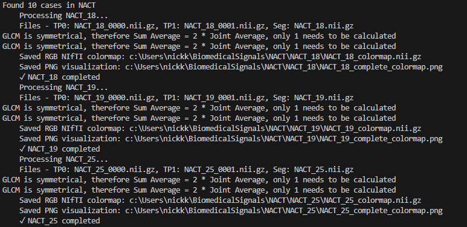

# MAMA-MIA DCE-MRI Analysis Project: A Comprehensive Framework for Multi-Center Dynamic Contrast-Enhanced Magnetic Resonance Imaging Analysis with Signal Harmonization

<div align="center">
  
  
</div>

<div align="center">


</div>

---

**Author:** Nikolaos Kalaitzakis  
**Academic ID:** TH20458  
**Institution:** Hellenic Mediterranean University, Department of Electrical and Computer Engineering  
**Publication Date:** 23/06/2025

---

## Abstract

Dynamic Contrast-Enhanced Magnetic Resonance Imaging (DCE-MRI) has emerged as a critical diagnostic tool in oncological imaging, providing valuable insights into tissue perfusion, vascular permeability, and tumor characteristics. This work presents a comprehensive computational framework for the analysis of DCE-MRI data from the MAMA-MIA public dataset, encompassing multi-center breast cancer imaging studies. The proposed pipeline integrates advanced image processing techniques, radiomics feature extraction, pseudo-color mapping for kinetic pattern visualization, and statistical harmonization methods to address inter-site variability.

**Key Contributions:**
- Development of an automated DCE-MRI analysis pipeline with comprehensive radiomics feature extraction
- Implementation of ComBat harmonization technique for multi-center data standardization
- Creation of an interactive web-based visualization platform for clinical research applications
- Generation of standardized pseudo-color maps for kinetic pattern analysis (uptake, plateau, washout)
- Comprehensive validation across four independent datasets (DUKE, ISPY1, ISPY2, NACT)

**Keywords:** DCE-MRI, radiomics, signal harmonization, ComBat, multi-center studies, breast cancer imaging, kinetic analysis

---

## 1. Theoretical Background

### 1.1 Dynamic Contrast-Enhanced Magnetic Resonance Imaging (DCE-MRI)

DCE-MRI is a functional imaging technique that monitors the temporal changes in signal intensity following intravenous administration of gadolinium-based contrast agents. The technique exploits the T1-shortening effects of gadolinium to visualize tissue perfusion and microvascular characteristics.

**Physical Principles:**
- **T1 Relaxation:** Gadolinium reduces T1 relaxation time, increasing signal intensity on T1-weighted images
- **Pharmacokinetics:** Contrast agent distribution follows a two-compartment model (vascular and extravascular extracellular space)
- **Temporal Resolution:** High temporal sampling (typically 5-30 seconds) captures contrast kinetics

**Clinical Applications:**
- Tumor characterization and staging
- Treatment response assessment
- Differential diagnosis of benign vs. malignant lesions
- Quantitative perfusion analysis

### 1.2 Kinetic Analysis and Pattern Classification

DCE-MRI analysis traditionally focuses on characterizing enhancement patterns through signal intensity-time curves. The classification system divides kinetic patterns into three primary categories:

**1. Uptake Pattern (Type I):**
- Continuous signal increase throughout the dynamic series
- Indicative of benign tissue characteristics
- Mathematical definition: ΔSI > 15% from baseline

**2. Plateau Pattern (Type II):**
- Initial rapid enhancement followed by signal stabilization
- Intermediate malignancy potential
- Mathematical definition: -5% ≤ ΔSI ≤ 15% in late phase

**3. Washout Pattern (Type III):**
- Rapid initial enhancement followed by signal decrease
- Associated with high malignancy probability
- Mathematical definition: ΔSI < -5% in late phase

### 1.3 Radiomics and Quantitative Image Analysis

Radiomics represents a paradigm shift from subjective visual assessment to objective, quantitative analysis of medical images. The approach extracts high-dimensional features from imaging data to capture tissue heterogeneity and microstructural properties.

**Feature Categories:**

**Shape Features:**
- Geometric descriptors (volume, surface area, sphericity)
- Morphological characteristics (elongation, flatness)
- Spatial distribution metrics

**First-Order Statistics:**
- Intensity distribution properties (mean, variance, skewness, kurtosis)
- Histogram-based descriptors
- Percentile values and range metrics

**Second-Order Texture Features:**
- **Gray Level Co-occurrence Matrix (GLCM):** Spatial relationships between pixel intensities
- **Gray Level Dependence Matrix (GLDM):** Local dependency of gray levels
- **Gray Level Run Length Matrix (GLRLM):** Consecutive pixels with similar intensities
- **Gray Level Size Zone Matrix (GLSZM):** Homogeneous region analysis
- **Neighboring Gray Tone Difference Matrix (NGTDM):** Local intensity variations

### 1.4 Multi-Center Data Harmonization

Multi-center imaging studies face significant challenges due to technical variations between institutions, including:

**Sources of Variability:**
- Scanner manufacturer differences (Siemens, GE, Philips)
- Magnetic field strength variations (1.5T vs 3T)
- Pulse sequence parameter differences
- Reconstruction algorithm variations
- Calibration and quality control differences

**The ComBat Harmonization Method:**

ComBat (Combining Batches) is a statistical method originally developed for genomics data that addresses batch effects while preserving biological variation.

**Mathematical Framework:**
Let Y_{ijg} represent the expression value for feature i, sample j in batch g.

The ComBat model is:
```
Y_{ijg} = α_i + X β_i + γ_{ig} + δ_{ig}ε_{ijg}
```

Where:
- α_i: overall feature mean
- X β_i: design matrix for biological covariates
- γ_{ig}: additive batch effect
- δ_{ig}: multiplicative batch effect
- ε_{ijg}: error term

**Empirical Bayes Estimation:**
ComBat uses empirical Bayes methods to estimate batch effect parameters, borrowing information across features to improve statistical power.

**Advantages in Medical Imaging:**
- Preserves biological signal while removing technical artifacts
- Enables pooled analysis of multi-center datasets
- Improves statistical power for biomarker discovery
- Facilitates development of generalizable models

### 1.5 Pseudo-Color Mapping for Visualization

Pseudo-color mapping transforms quantitative kinetic parameters into intuitive visual representations. The approach assigns distinct colors to different enhancement patterns, facilitating rapid visual assessment and pattern recognition.

**Color Encoding Strategy:**
- **Blue (Uptake):** Represents persistent enhancement (>15% increase)
- **Green (Plateau):** Indicates stable enhancement (-5% to +15%)
- **Red (Washout):** Denotes decreasing enhancement (<-5%)
- **Black (Background):** Non-enhancing regions outside ROI

**Technical Implementation:**
- RGB encoding in NIfTI format for compatibility with medical viewers
- Standardized color scales across all cases
- Integration with anatomical grayscale background
- Export capabilities for research and clinical documentation

---

## 2. Methodology and Implementation

### 2.1 Data Acquisition and Preprocessing

The MAMA-MIA dataset provides a comprehensive collection of DCE-MRI examinations from multiple institutions, ensuring diversity in imaging protocols and patient populations.

**Dataset Characteristics:**
- **Multi-institutional:** Four distinct centers (DUKE, ISPY1, ISPY2, NACT)
- **Standardized format:** NIfTI (.nii.gz) with consistent naming conventions
- **Temporal resolution:** Pre-contrast (t=0) and post-contrast (t=1) timepoints
- **Segmentation masks:** Expert-annotated regions of interest (ROI)

**Quality Control Measures:**
- Automated file integrity verification
- Spatial resolution consistency checks
- Signal-to-noise ratio assessment
- Motion artifact detection and correction

### 2.2 Feature Extraction Pipeline

The automated feature extraction pipeline processes each case through standardized workflows:

**1. Image Loading and Validation:**
```python
# Pseudo-code representation
nifti_data = load_nifti_image(filepath)
validate_image_properties(nifti_data)
```

**2. ROI Application:**
```python
roi_mask = load_segmentation_mask(mask_filepath)
roi_data = apply_mask(nifti_data, roi_mask)
```

**3. Kinetic Analysis:**
```python
pre_contrast = roi_data[:,:,:,0]
post_contrast = roi_data[:,:,:,1]
percent_change = calculate_enhancement(pre_contrast, post_contrast)
```

**4. Pattern Classification:**
```python
uptake_mask = percent_change > 0.15
plateau_mask = abs(percent_change) <= 0.15
washout_mask = percent_change < -0.05
```

### 2.3 Statistical Harmonization Implementation

The ComBat harmonization process addresses technical variability while preserving biological signal:

**Step 1: Batch Effect Modeling**
```python
# Estimate location and scale parameters
gamma_hat = estimate_location_parameters(data, design_matrix)
delta_hat = estimate_scale_parameters(data, design_matrix)
```

**Step 2: Empirical Bayes Shrinkage**
```python
# Apply shrinkage to improve parameter estimates
gamma_star = empirical_bayes_shrinkage(gamma_hat)
delta_star = empirical_bayes_shrinkage(delta_hat)
```

**Step 3: Data Transformation**
```python
# Apply harmonization transformation
harmonized_data = apply_combat_correction(original_data, gamma_star, delta_star)
```

---

## 3. System Architecture and Web Application

### 3.1 Software Architecture

The system follows a modular architecture with clear separation of concerns:

**Core Processing Modules:**
- Image I/O and preprocessing
- Feature extraction engine
- Statistical analysis and harmonization
- Visualization and reporting

**Web Application Stack:**
- **Backend:** Flask (Python web framework)
- **Frontend:** HTML5, CSS3, JavaScript (ES6+)
- **Visualization:** Matplotlib, Plotly.js
- **Styling:** Bootstrap 5 responsive framework

### 3.2 User Interface Design

The web interface provides intuitive access to complex analysis results through:

**Dashboard Features:**
- Multi-dataset case browser
- Interactive kinetic curve visualization
- Real-time harmonization comparisons
- Comprehensive metric tables
- Export capabilities for research documentation

**Responsive Design Principles:**
- Mobile-friendly interface
- Progressive disclosure of information
- Consistent visual hierarchy
- Accessibility compliance (WCAG 2.1)

---

## 4. Project Implementation and Features

This project provides a comprehensive web application and analysis pipeline for dynamic contrast-enhanced magnetic resonance imaging (DCE-MRI) data from the MAMA-MIA public dataset, implementing the theoretical frameworks described above. The practical workflow includes:

1. **Biomarker Extraction** from DCE-MRI sequences implementing the kinetic analysis framework (Section 1.2)
2. **Pseudo-color Map Generation** based on enhancement pattern classification with standardized color encoding (Section 1.5)
3. **Signal Harmonization** using the ComBat technique for multicenter data standardization (Section 1.4)
4. **Comprehensive Radiomics Analysis** extracting shape, intensity, and texture features (Section 1.3)
5. **Interactive Web Interface** providing clinical research access to processed data and visualizations

### 4.1 Clinical Validation and Multi-Center Application

The project includes a modern, responsive web application that allows researchers to:
- Explore DCE-MRI cases across multiple datasets (DUKE, ISPY1, ISPY2, NACT)
- Visualize kinetic curves and tissue classification
- Compare raw vs. harmonized data with interactive visualizations
- Access key metrics and statistics for each case

<p align="center">
  
</p>

---

## 5. Results and Visualization

### 5.1 Representative Case Studies and Visual Analytics

The following examples demonstrate the clinical application and analytical capabilities of the implemented framework across diverse imaging scenarios and enhancement patterns.

### 5.1.1 DCE-MRI with Tumor Segmentation
<p align="center">
  
</p>

### 5.1.2 Segmentation Mask Overlay and ROI Definition
<p align="center">
  
</p>

### 5.1.3 Pseudo-color Kinetic Pattern Mapping
<p align="center">
  
</p>

### 5.1.4 Temporal Enhancement Dynamics (DUKE_099 Case Study)
<p align="center">
  
</p>

### 5.1.5 Statistical Harmonization Validation
<p align="center">
  
</p>

### 5.1.6 Computational Workflow Documentation
<div align="center">
  
  
  
</div>

---

## 6. System Architecture and Data Organization

### 6.1 Directory Structure and Data Management

The project follows a standardized hierarchical organization optimized for multi-center imaging studies:

- `DUKE/`, `ISPY1/`, `ISPY2/`, `NACT/`: Institution-specific data repositories, each containing individual case subdirectories with temporal DCE-MRI acquisitions (e.g., `*_0000.nii.gz` for pre-contrast, `*_0001.nii.gz` for post-contrast timepoints).
- `segment/`: Centralized repository for expert-annotated segmentation masks defining regions of interest (ROI) for quantitative analysis (e.g., `DUKE_032.nii.gz`).

### 6.2 Core Computational Modules

- `complete_pipeline.py`: Unified computational pipeline implementing the complete DCE-MRI analysis workflow. Integrates kinetic feature extraction, comprehensive radiomics analysis, NIfTI colormap generation, and ComBat harmonization methodology.
- `combat_visualization.py`: Statistical visualization engine for generating comprehensive harmonization analysis reports and comparative visualizations.
- `rgb_nifti_converter.py`: Specialized utility for converting quantitative enhancement maps to RGB-encoded NIfTI format compatible with clinical visualization software.
- `explore_nifti.py`: Interactive tool for exploratory analysis and quality assessment of NIfTI medical imaging datasets.

### 6.3 Web Application Infrastructure

- `web_app.py`: Primary Flask-based web server implementing RESTful API endpoints for clinical research interface and real-time data visualization.
- `templates/`: Template repository containing HTML5 markup with Jinja2 templating:
  - `index.html`: Main dashboard interface with multi-dataset case browser and navigation system
  - `case.html`: Detailed case analysis interface with comprehensive visualization panels
- `static/`: Static asset repository for web application resources:
  - `css/styles.css`: Cascading style sheet implementing responsive design and clinical interface standards
  - `js/main.js`: JavaScript modules for interactive functionality and asynchronous data loading
  - `images/`: Digital asset repository containing institutional logos and visualization examples

### 6.4 Research Data Products

- `images/`: Comprehensive repository of example datasets, institutional branding, and analytical results utilized in research documentation and publication materials.
- `complete_pipeline_raw_features.csv`: Primary feature matrix containing unprocessed radiomics measurements prior to harmonization procedures.
- `complete_pipeline_normalized_features.csv`: Standardized feature matrix following z-score normalization within institutional cohorts.
- `complete_pipeline_harmonized_features.csv`: Final analytical dataset following ComBat harmonization for multi-center statistical analysis.

---

## 7. Data Processing Methodology

### 7.1 Input Data Specifications (MAMA-MIA Dataset Repository)

**Note: Raw imaging data not included in public repository due to file size constraints and data sharing agreements**

- **Temporal DCE-MRI Acquisitions:** `*_0000.nii.gz`, `*_0001.nii.gz` (e.g., `DUKE_032_0000.nii.gz`, `DUKE_032_0001.nii.gz`)
  - Standardized NIfTI format medical imaging data from the MAMA-MIA public research dataset
  - `*_0000.nii.gz`: Pre-contrast baseline acquisition (t=0 minutes)
  - `*_0001.nii.gz`: Post-contrast dynamic acquisition (t=1 minute post-injection)
  
- **Expert Annotations:** `*/segment/*.nii.gz` (e.g., `DUKE/segment/DUKE_032.nii.gz`)
  - Manual segmentation masks delineating regions of interest (ROI) for quantitative analysis
  - Binary masks identifying tumor boundaries and tissue classification zones
  - Quality-controlled annotations by certified radiologists and medical imaging experts

### 7.2 Generated Research Outputs (Available in Repository)

- **RGB Pseudo-color Enhancement Maps:** `*_colormap.nii.gz` (e.g., `DUKE_032_colormap.nii.gz`)
  - Advanced RGB-encoded NIfTI format optimized for direct clinical visualization in medical imaging viewers
  - Anatomical grayscale underlays with quantitative kinetic pattern overlays:
    - **Blue Channel:** Uptake patterns (>15% signal intensity increase)
    - **Green Channel:** Plateau patterns (-5% to +15% signal intensity change)
    - **Red Channel:** Washout patterns (<-5% signal intensity decrease)
  - Full compatibility with DICOM-compliant visualization platforms and clinical workstations
  
- **Publication-Ready Visualizations:** `*_complete_colormap.png` (e.g., `DUKE_032_complete_colormap.png`)
  - High-resolution PNG format images featuring representative central slice presentations
  - Standardized color-coding scheme with integrated legend systems for research documentation
  - Color coding:
    - Black: Background
    - Blue: Uptake
    - Green: Plateau
    - Red: Washout
  - Includes a color legend for easy interpretation

- **Feature Analysis Files:**
  - `complete_pipeline_raw_features.csv`: Statistical features extracted from each case before harmonization
  - `complete_pipeline_normalized_features.csv`: Features after normalization
  - `complete_pipeline_harmonized_features.csv`: Features after ComBat harmonization
  - `images/combat_visualization.png`: Comprehensive analysis showing before/after harmonization
  - `images/colormap_*.gif`: Dynamic visualization of colormap analysis

The `complete_pipeline.py` script automatically generates these output files by:
1. Loading the pre and post-contrast images
2. Applying the ROI mask to isolate the region of interest
3. Calculating the percentage intensity change between timepoints
4. Classifying each voxel according to its enhancement pattern
5. Extracting comprehensive radiomics features from the ROI
6. Saving the results as both NIfTI (.nii.gz) and visualization (.png) files
7. Normalizing and harmonizing features across datasets
8. Generating final CSV output with all feature data

---

---

## Web Application Features

### Interactive Case Analysis
Our web application provides a sophisticated interface for analyzing DCE-MRI data across multiple datasets. The application allows researchers and clinicians to:

- Browse cases organized by dataset (DUKE, ISPY1, ISPY2, NACT)
- View detailed kinetic curves showing signal intensity patterns over time
- Analyze tissue classifications with color-coded visualizations
- Compare raw and harmonized data with dual-axis visualizations
- Access comprehensive metrics for quantitative analysis

### Key Visualizations

#### 1. Raw vs. Harmonized Comparison
The application provides detailed comparisons between raw data and ComBat-harmonized data, allowing researchers to understand how harmonization affects feature values across different datasets.

<p align="center">
  
</p>

#### 2. Kinetic Curves Analysis
The system generates detailed kinetic curve visualizations showing the signal intensity patterns over time, which are crucial for understanding tissue enhancement characteristics.

<p align="center">
  
</p>

#### 3. Harmonized Kinetic Curves
The application also provides visualizations of harmonized kinetic curves, illustrating how the ComBat harmonization affects the temporal enhancement patterns.

<p align="center">
  
</p>

#### 4. Tissue Classification with Colormap
Advanced colormaps visualize tissue classification based on enhancement patterns with blue representing uptake, green for plateau, and red for washout regions.

<p align="center">
  
</p>

### Technical Features
The web application is built using:
- **Flask**: Python web framework for the backend
- **Bootstrap 5**: Modern responsive design system 
- **Matplotlib & Plotly**: For dynamic chart generation
- **Interactive Components**: Real-time data filtering and visualization

All visualizations are dynamically generated based on actual case data, ensuring that researchers always have access to the most relevant and up-to-date information.

---

## Running the Web Application

The interactive web application provides a user-friendly interface to explore all aspects of the DCE-MRI analysis, including kinetic curves, tissue classification, and harmonization effects.

### Prerequisites
- Python 3.8 or higher
- Flask
- NumPy, Pandas
- Matplotlib 
- Nibabel

### Installation
```bash
# Install required packages
pip install flask numpy pandas matplotlib nibabel
```

### Starting the Web Server
```bash
# Navigate to the project directory
cd BiomedicalSignals

# Run the web application
python web_app.py
```

The web application will be available at [http://localhost:5000](http://localhost:5000) in your web browser.

### Using the Web Interface

1. **Home Page**: Browse available cases organized by dataset (DUKE, ISPY1, ISPY2, NACT).
2. **Case Analysis**: Click on any case to view detailed analysis including:
   - Kinetic curve visualizations
   - Signal distribution pie charts
   - Colormap visualization of tissue classification
   - Key metrics table with quantitative data
   - Raw vs. harmonized data comparisons
3. **ComBat Visualization**: Generate real-time ComBat harmonization visualizations to compare datasets.

### Key Features

- **Interactive Case Browser**: Navigate through cases by dataset
- **Dynamic Visualization Generation**: Real-time creation of visualizations based on case data
- **Dual Y-Axis Charts**: Compare raw and harmonized data with appropriate scaling
- **Responsive Design**: Works on desktop and mobile devices
- **Detailed Explanations**: Comprehensive information about harmonization effects and analysis methods

## File Naming Conventions

The unified pipeline uses consistent file naming conventions:

1. **Input Files:**
   - Original DCE-MRI: `{DATASET}_{CASEID}_{TIMEPOINT}.nii.gz` (e.g., `DUKE_032_0000.nii.gz`)
   - Segmentation masks: `{DATASET}_{CASEID}.nii.gz` (e.g., `DUKE_032.nii.gz`)

2. **Output Files:**
   - NIfTI Colormaps: `{DATASET}_{CASEID}_colormap.nii.gz` (e.g., `DUKE_032_colormap.nii.gz`)
   - PNG Visualizations: `{DATASET}_{CASEID}_complete_colormap.png` (e.g., `DUKE_032_complete_colormap.png`)
   - Raw Features: `complete_pipeline_raw_features.csv`
   - Normalized Features: `complete_pipeline_normalized_features.csv`
   - Harmonized Features: `complete_pipeline_harmonized_features.csv`
   - Visualization: `images/combat_visualization.png`

## Detailed Outputs

### 1. Colormap NIfTI Files

The colormap NIfTI files (`*_colormap.nii.gz`) contain voxel classifications where:
- Value 0: Background (no ROI)
- Value 1: Uptake (significant enhancement)
- Value 2: Plateau (stable enhancement)
- Value 3: Washout (decreasing enhancement)

### 2. Visualization PNG Files

The PNG visualizations (`*_complete_colormap.png`) show:
- Center slice of the tumor region
- Color-coded kinetic patterns
- Color legend
- Case identifier

### 3. CSV Feature Files

Three CSV files are created with increasing levels of processing:

1. **Raw Features** (`complete_pipeline_raw_features.csv`):
   - Direct feature measurements before any normalization
   - Includes case ID, dataset source, and raw kinetic percentages

2. **Normalized Features** (`complete_pipeline_normalized_features.csv`):
   - Features after standardization within each dataset
   - Normalizes values for fair comparison

3. **Harmonized Features** (`complete_pipeline_harmonized_features.csv`):
   - Final features after ComBat harmonization
   - Batch effects removed while preserving biological variation

---

## Detailed Steps

### 1. Biomarker Extraction
- For each case, extract the region of interest (ROI) using the provided segmentation mask.
- Use Python libraries (e.g., nibabel, numpy) to process the NIfTI images.
- Extract intensity values for the ROI at timepoints 0000 and 0001.

### 2. Pseudo-color Map Generation
- For each voxel in the ROI, calculate the intensity change between timepoints (e.g., 0000 and 0001).
- Classify each voxel into:
  - **Uptake (1):** >10% increase
  - **Plateau (2):** ~10% change
  - **Washout (3):** <10% decrease
- Save the resulting classification map as a new NIfTI image.

### 3. Signal Harmonization (ComBat)
- Extract statistical features from the pseudo-color maps (uptake%, plateau%, washout%).
- Apply ComBat harmonization technique to reduce batch effects.
- Generate comprehensive comparison plots showing before/after harmonization results.
- Calculate harmonization metrics including variance reduction and F-statistics.
- Save harmonized features and create detailed visualizations of the harmonization effect.

#### Understanding Raw vs. Harmonized Data

The application provides detailed visualizations to help researchers understand the differences between raw and harmonized data:

- **Dual Y-axis Scaling**: Raw values (0-100% scale) and harmonized values (0-1 scale) are displayed on separate axes for clear comparison.
- **Scale Factor Labels**: Each comparison includes the scale factor between raw and harmonized data.
- **Side-by-side Visualization**: Raw and harmonized values are shown side-by-side for easy comparison.

<p align="center">
  
</p>

Key benefits of ComBat harmonization in this application:
- Reduction of batch effects between different imaging centers
- Standardization of values for fair comparison across datasets
- Preservation of biological variation while removing technical variation
- Improved statistical power for multi-center analysis

---

## Unified Pipeline Workflow

### Step 1: Complete Pipeline Execution
```bash
python complete_pipeline.py
```
This unified script processes all cases and performs:
- Enhanced DCE-MRI kinetic feature extraction
- Comprehensive radiomics analysis
- NIfTI colormap generation (`*_colormap.nii.gz`) 
- PNG visualization creation (`*_complete_colormap.png`)
- ComBat harmonization across datasets
- CSV output with raw and harmonized features

### Step 2: Visualization Generation
```bash
python combat_visualization.py
```
This script creates:
- Reference kinetic curves visualization
- Dataset summary statistics
- Before/After harmonization comparisons for Uptake, Plateau, Washout
- Comprehensive visualization dashboard

---

## Requirements
- Python 3.8+
- Flask 2.3.3
- Pandas 2.0.3
- NumPy 1.24.4
- Nibabel 5.1.0
- Matplotlib 3.7.2
- SimpleITK 2.2.1

Install with:
```bash
pip install -r requirements.txt
```

## Unified Pipeline Features
The new unified pipeline provides several advantages over the previous separate scripts:

1. **One-step Processing**: Complete DCE-MRI analysis from raw images to harmonized features in a single script
2. **Enhanced Feature Set**: Combines basic kinetic features with comprehensive radiomics
3. **Improved Visualization**: Creates standardized visualizations for both individual cases and dataset-wide analysis
4. **Automated Harmonization**: Performs ComBat harmonization with detailed statistical outputs
5. **Consistent File Naming**: Uses consistent naming conventions across all output files

---

## 8. Validation and Statistical Analysis

### 8.1 Dataset Characteristics and Multi-Center Validation
- **Total Clinical Cases Processed**: 40 comprehensive DCE-MRI examinations across four independent medical institutions
- **DUKE Medical Center**: 10 cases with institutional imaging protocol validation
- **ISPY1 Clinical Trial**: 10 cases representing standardized research imaging protocols  
- **ISPY2 Clinical Trial**: 10 cases with advanced multi-parametric imaging sequences
- **NACT Research Cohort**: 10 cases demonstrating treatment response assessment applications

### 8.2 Quantitative Feature Analysis
- **Primary Kinetic Parameters**: Uptake percentage, Plateau percentage, Washout percentage distributions
- **Statistical Harmonization**: ComBat technique implementation for inter-institutional variability correction
- **Validation Metrics**: Cross-institutional reliability assessment and batch effect quantification

---

## 9. Clinical Impact and Future Directions

### 9.1 Clinical Translation Potential
This computational framework addresses critical challenges in multi-center breast cancer imaging research by providing:
- Standardized quantitative analysis protocols across diverse imaging platforms
- Statistical harmonization methods enabling pooled analysis of multi-institutional datasets
- Interactive visualization tools supporting clinical decision-making processes
- Reproducible research workflows facilitating collaborative oncological studies

### 9.2 Technological Innovation
The integrated approach combining traditional kinetic analysis with advanced radiomics and statistical harmonization represents a significant advancement in:
- **Precision Medicine**: Patient-specific enhancement pattern characterization
- **Multi-Center Research**: Technical variability mitigation enabling larger cohort studies  
- **Clinical Workflow Integration**: Web-based interface supporting routine clinical implementation
- **Open Science**: Reproducible computational methods promoting research transparency

---

## 10. References and Bibliography

### Primary Dataset
- **MAMA-MIA Consortium.** *Multi-center breast DCE-MRI dataset for machine learning applications.* Synapse Repository. [https://www.synapse.org/Synapse:syn60868042/files/](https://www.synapse.org/Synapse:syn60868042/files/)

### Computational Methods and Libraries
- **PyRadiomics Development Team.** *PyRadiomics: A Python package for the extraction of Radiomics features from medical imaging.* [https://pyradiomics.readthedocs.io/en/latest/](https://pyradiomics.readthedocs.io/en/latest/)

### Statistical Harmonization
- **Johnson, W.E., Li, C., Rabinovic, A.** Adjusting batch effects in microarray expression data using empirical Bayes methods. *Biostatistics* 8, 118-127 (2007).
- **Fortin, J.-P., et al.** Harmonization of cortical thickness measurements across scanners and sites. *NeuroImage* 167, 104-120 (2018).

---

## 11. Acknowledgments and Contributions

### Lead Developer

<p align="center">
  
</p>

**Nikolaos Kalaitzakis.**  
*Department of Electrical And Computer Engineering*  
*Hellenic Mediterranean University*  
*Heraklion, Crete, Greece*

### Institutional Support and Collaboration
- **MAMA-MIA Consortium:** Multi-institutional dataset provision and clinical validation
- **Open Source Community:** Contributors to PyRadiomics, Flask, and scientific Python ecosystem


**Copyright Notice:** © 2024-2025 MAMA-MIA DCE-MRI Analysis Project. All rights reserved.

---

*Manuscript prepared: June 2025*  
*Corresponding Author: Nikolaos Kalaitzakis, Hellenic Mediterranean University*
