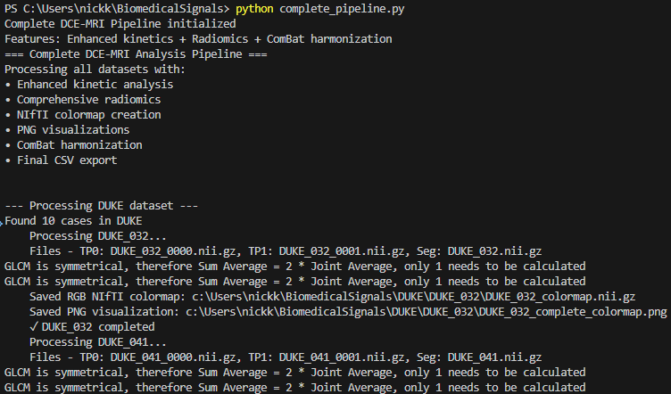

# MAMA-MIA DCE-MRI Analysis Project

<p align="center">
  
</p>

---

## Overview
This project provides a pipeline for the analysis of dynamic contrast-enhanced magnetic resonance imaging (DCE-MRI) data from the MAMA-MIA public dataset. The workflow includes:

1. **Biomarker Extraction** from DCE-MRI sequences with contrast agent.
2. **Pseudo-color Map Generation** based on biomarker characteristics.
3. **Signal Harmonization** using the ComBat technique for multicenter data.
4. **Comprehensive Visualization** of kinetic curves and harmonization effects.

---

## Example Images

### Example 1: DCE-MRI with Tumor Segmentation
<p align="center">
  
</p>

### Example 2: Segmentation Mask Overlay
<p align="center">
  
</p>

### Example 3: Pseudo-color Map (Uptake/Plateau/Washout)
<p align="center">
  
</p>

### Example 4: Dynamic Animation (DUKE_099)
<p align="center">
  
</p>

### Example 5: ComBat Harmonization Visualization
<p align="center">
  
</p>

### Example 6: Terminal Execution Timeline
<div align="center">
  
  
  
</div>

---

## Project Structure
- `DUKE/`, `ISPY1/`, `ISPY2/`, `NACT/`: Folders for each study group, each containing subfolders for individual cases and their respective DCE-MRI timepoints (e.g., `*_0000.nii.gz`, `*_0001.nii.gz`, ...).
- `segment/`: Contains segmentation masks for each case (e.g., `DUKE_032.nii.gz`).
- `complete_pipeline.py`: Unified Python script for the entire DCE-MRI pipeline. Combines enhanced feature extraction, radiomics analysis, NIfTI colormap creation, and ComBat harmonization in a single file.
- `combat_visualization.py`: Unified visualization script for creating comprehensive harmonization visualizations.
- `images/`: Contains example images, logos, and analysis results used in this README.
- `complete_pipeline_raw_features.csv`: Raw extracted features before harmonization.
- `complete_pipeline_harmonized_features.csv`: Features after ComBat harmonization.

## Data Files

### Input Files (Not included in repository due to size limitations)
- **DCE-MRI Timepoints:** `*_0000.nii.gz`, `*_0001.nii.gz` (e.g., `DUKE_032_0000.nii.gz`, `DUKE_032_0001.nii.gz`)
  - These are the raw NIfTI format images from the MAMA-MIA dataset
  - `*_0000.nii.gz`: Pre-contrast image (t=0)
  - `*_0001.nii.gz`: Post-contrast image (t=1)
  
- **Segmentation Files:** `*/segment/*.nii.gz` (e.g., `DUKE/segment/DUKE_032.nii.gz`)
  - These files contain the segmentations (masks) of the regions of interest (ROI)
  - Used to identify the tumor or tissue areas for analysis

### Output Files (Included in repository)
- **RGB Pseudo-color Maps:** `*_colormap.nii.gz` (e.g., `DUKE_032_colormap.nii.gz`)
  - Enhanced RGB-encoded NIfTI format for direct visualization in viewers like Mango
  - Shows the underlying MRI as grayscale background with colored overlay:
    - Blue: Uptake (>15% intensity increase)
    - Green: Plateau (between -5% and +15% intensity change)
    - Red: Washout (<-5% intensity decrease)
  - Compatible with standard DICOM viewers that support RGB NIfTI format
  
- **Visualization Images:** `*_complete_colormap.png` (e.g., `DUKE_032_complete_colormap.png`)
  - PNG images showing a central slice of the pseudo-color map
  - Color coding:
    - Black: Background
    - Blue: Uptake
    - Green: Plateau
    - Red: Washout
  - Includes a color legend for easy interpretation

- **Feature Analysis Files:**
  - `complete_pipeline_raw_features.csv`: Statistical features extracted from each case before harmonization
  - `complete_pipeline_normalized_features.csv`: Features after normalization
  - `complete_pipeline_harmonized_features.csv`: Features after ComBat harmonization
  - `images/combat_visualization.png`: Comprehensive analysis showing before/after harmonization
  - `images/colormap_*.gif`: Dynamic visualization of colormap analysis

The `complete_pipeline.py` script automatically generates these output files by:
1. Loading the pre and post-contrast images
2. Applying the ROI mask to isolate the region of interest
3. Calculating the percentage intensity change between timepoints
4. Classifying each voxel according to its enhancement pattern
5. Extracting comprehensive radiomics features from the ROI
6. Saving the results as both NIfTI (.nii.gz) and visualization (.png) files
7. Normalizing and harmonizing features across datasets
8. Generating final CSV output with all feature data

---

## 🎯 Interactive Dashboard Suite

The project now includes a comprehensive suite of interactive dashboards for advanced feature exploration and visualization with multiple interface levels:

### 🌌 Ultra-Advanced Dashboard (`ultra_advanced_dashboard.py`)
**Next-generation quantum-inspired interface featuring:**
- **Quantum-inspired themes**: Dynamic color schemes (Cyber, Neon, Aurora, Quantum)
- **3D Neural Explorer**: Multi-dimensional feature space visualization
- **Holographic PCA**: Advanced principal component analysis with 3D effects
- **AI Pattern Recognition**: t-SNE analysis with neural network styling
- **Real-time streaming**: Live data visualization simulation
- **Advanced animations**: Particle effects, neural backgrounds, morphing charts
- **Smart insights**: AI-powered analysis recommendations

### 📊 Enhanced Dashboard (`enhanced_dashboard.py`)
**Modern interface with sophisticated features:**
- Glass-morphism design with animated transitions
- Floating particle effects and gradient backgrounds
- Advanced PCA and clustering analysis
- Interactive scatter plots and correlation matrices
- Modern responsive design

### 🎯 Interactive Dashboard (`interactive_dashboard.py`)
**Essential features with clean interface:**
- Core visualization capabilities
- Basic PCA and clustering
- Standard interactive plots
- Functional analysis tools

### Quick Launch
```bash
# Ultra-Advanced Experience (recommended)
python ultra_advanced_dashboard.py

# Windows Batch Launcher (Command Prompt)
launch_ultra_dashboard.bat

# Windows PowerShell Launcher
.\launch_ultra_dashboard.bat
# OR the PowerShell version
.\launch_ultra_dashboard.ps1

# Enhanced Experience
python enhanced_dashboard.py

# Basic Experience
python interactive_dashboard.py

# Access at: http://127.0.0.1:8050
```

### Core Features (All Versions)
- **Real-time Feature Exploration**: Interactive filtering by dataset, processing stage, and feature category
- **Multi-dimensional Visualizations**: Box plots, correlation matrices, heatmaps, and scatter plots
- **Advanced Analytics**: PCA analysis, K-means clustering, and dimensionality reduction
- **Time-series Analysis**: Kinetic curve visualization and enhancement pattern analysis
- **Statistical Summaries**: Comprehensive feature statistics and dataset comparisons

### Dashboard Sections
1. **Feature Overview**: Distribution analysis and correlation matrices
2. **Correlation Analysis**: Comprehensive feature relationship exploration
3. **Time-series Analysis**: Kinetic curve patterns and enhancement dynamics
4. **PCA Analysis**: Principal component analysis and variance explanation
5. **Clustering Analysis**: K-means clustering and pattern identification

### Data Sources
The dashboard automatically loads and analyzes three feature datasets:
- `complete_pipeline_raw_features.csv` - Original extracted features
- `complete_pipeline_normalized_features.csv` - Normalized features
- `complete_pipeline_harmonized_features.csv` - ComBat harmonized features

---

## File Naming Conventions

The unified pipeline uses consistent file naming conventions:

1. **Input Files:**
   - Original DCE-MRI: `{DATASET}_{CASEID}_{TIMEPOINT}.nii.gz` (e.g., `DUKE_032_0000.nii.gz`)
   - Segmentation masks: `{DATASET}_{CASEID}.nii.gz` (e.g., `DUKE_032.nii.gz`)

2. **Output Files:**
   - NIfTI Colormaps: `{DATASET}_{CASEID}_colormap.nii.gz` (e.g., `DUKE_032_colormap.nii.gz`)
   - PNG Visualizations: `{DATASET}_{CASEID}_complete_colormap.png` (e.g., `DUKE_032_complete_colormap.png`)
   - Raw Features: `complete_pipeline_raw_features.csv`
   - Normalized Features: `complete_pipeline_normalized_features.csv`
   - Harmonized Features: `complete_pipeline_harmonized_features.csv`
   - Visualization: `images/combat_visualization.png`

## Detailed Outputs

### 1. Colormap NIfTI Files

The colormap NIfTI files (`*_colormap.nii.gz`) contain voxel classifications where:
- Value 0: Background (no ROI)
- Value 1: Uptake (significant enhancement)
- Value 2: Plateau (stable enhancement)
- Value 3: Washout (decreasing enhancement)

### 2. Visualization PNG Files

The PNG visualizations (`*_complete_colormap.png`) show:
- Center slice of the tumor region
- Color-coded kinetic patterns
- Color legend
- Case identifier

### 3. CSV Feature Files

Three CSV files are created with increasing levels of processing:

1. **Raw Features** (`complete_pipeline_raw_features.csv`):
   - Direct feature measurements before any normalization
   - Includes case ID, dataset source, and raw kinetic percentages

2. **Normalized Features** (`complete_pipeline_normalized_features.csv`):
   - Features after standardization within each dataset
   - Normalizes values for fair comparison

3. **Harmonized Features** (`complete_pipeline_harmonized_features.csv`):
   - Final features after ComBat harmonization
   - Batch effects removed while preserving biological variation

---

## Detailed Steps

### 1. Biomarker Extraction
- For each case, extract the region of interest (ROI) using the provided segmentation mask.
- Use Python libraries (e.g., nibabel, numpy) to process the NIfTI images.
- Extract intensity values for the ROI at timepoints 0000 and 0001.

### 2. Pseudo-color Map Generation
- For each voxel in the ROI, calculate the intensity change between timepoints (e.g., 0000 and 0001).
- Classify each voxel into:
  - **Uptake (1):** >10% increase
  - **Plateau (2):** ~10% change
  - **Washout (3):** <10% decrease
- Save the resulting classification map as a new NIfTI image.

### 3. Signal Harmonization (ComBat)
- Extract statistical features from the pseudo-color maps (uptake%, plateau%, washout%).
- Apply ComBat harmonization using the `neuroCombat` library to reduce batch effects.
- Generate comprehensive comparison plots showing before/after harmonization results.
- Calculate harmonization metrics including variance reduction and F-statistics.
- Save harmonized features and create detailed visualizations of the harmonization effect.

---

## Unified Pipeline Workflow

### Step 1: Complete Pipeline Execution
```bash
python complete_pipeline.py
```
This unified script processes all cases and performs:
- Enhanced DCE-MRI kinetic feature extraction
- Comprehensive radiomics analysis
- NIfTI colormap generation (`*_colormap.nii.gz`) 
- PNG visualization creation (`*_complete_colormap.png`)
- ComBat harmonization across datasets
- CSV output with raw and harmonized features

### Step 2: Visualization Generation
```bash
python combat_visualization.py
```
This script creates:
- Reference kinetic curves visualization
- Dataset summary statistics
- Before/After harmonization comparisons for Uptake, Plateau, Washout
- Comprehensive visualization dashboard

---

## Requirements
- Python 3.8+
- nibabel
- numpy
- matplotlib
- seaborn
- scipy
- pandas
- neuroCombat
- SimpleITK
- pyradiomics (for comprehensive feature extraction)

### 🎮 Interactive Dashboard Requirements
For the advanced interactive dashboard functionality:
- **dash** - Web application framework
- **plotly** - Interactive visualization library  
- **scikit-learn** - Machine learning tools for PCA and clustering

Install with:
```bash
pip install dash plotly scikit-learn
```

## Unified Pipeline Features
The new unified pipeline provides several advantages over the previous separate scripts:

1. **One-step Processing**: Complete DCE-MRI analysis from raw images to harmonized features in a single script
2. **Enhanced Feature Set**: Combines basic kinetic features with comprehensive radiomics
3. **Improved Visualization**: Creates standardized visualizations for both individual cases and dataset-wide analysis
4. **Automated Harmonization**: Performs ComBat harmonization with detailed statistical outputs
5. **Consistent File Naming**: Uses consistent naming conventions across all output files

## Dataset Statistics
- **Total Cases Processed**: 40 cases across 4 datasets
- **DUKE**: 10 cases
- **ISPY1**: 10 cases  
- **ISPY2**: 10 cases
- **NACT**: 10 cases
- **Features Analyzed**: Uptake percentage, Plateau percentage, Washout percentage
- **Harmonization Method**: ComBat (neuroCombat implementation)

---

## References
- [MAMA-MIA Dataset](https://www.synapse.org/Synapse:syn60868042/files/)
- [PyRadiomics Documentation](https://pyradiomics.readthedocs.io/en/latest/)
- [neuroCombat](https://github.com/Jfortin1/neuroCombat)

---

## Contribution and Credits

<p align="center">  
</p>

---

## RGB NIfTI Visualization Enhancement

### New Features (June 2025)
- **Enhanced Visualization**: RGB-encoded NIfTI files now show the underlying MRI grayscale image
- **Improved Compatibility**: Works directly with viewers like Mango without post-processing
- **Visual Clarity**: Clear distinction between tissue regions with colorized overlays

### Converting Existing Colormaps
To convert previously generated colormaps to the RGB format with visible background:
```bash
python rgb_nifti_converter.py
```
This utility will process all datasets and replace standard colormaps with RGB-encoded versions.

---

## 🎉 Project Status & New Features (June 2025)

### ✅ Completed Enhancements

#### 1. RGB NIfTI Visualization Enhancement
- **Enhanced RGB Output**: Colormap files now show underlying MRI as grayscale background
- **Improved Compatibility**: Direct visualization in Mango and other DICOM viewers
- **Conversion Utility**: `rgb_nifti_converter.py` for upgrading existing colormaps

#### 2. Interactive Dashboard Implementation
- **Comprehensive Web Interface**: Real-time feature exploration at `http://127.0.0.1:8050`
- **Multi-dimensional Analysis**: PCA, clustering, correlation, and time-series analysis
- **Dataset Comparison**: Cross-dataset harmonization visualization
- **Export-ready Visualizations**: High-quality plots for research publications

#### 3. Advanced Analytics
- **Principal Component Analysis**: Dimensionality reduction and feature importance
- **K-means Clustering**: Automatic patient subgroup identification  
- **Statistical Comparisons**: Before/after harmonization analysis
- **Interactive Filtering**: Real-time data exploration by dataset and feature type

### 🚀 Quick Start Guide

#### Run the Complete Pipeline
```bash
python complete_pipeline.py
```

#### Launch Interactive Dashboard
```bash
python dashboard_simple.py
# OR double-click launch_dashboard.bat
# Open browser to: http://127.0.0.1:8050
```

#### Convert Existing Colormaps to RGB
```bash
python rgb_nifti_converter.py
```

### 📊 Key Project Outputs

1. **Enhanced Visualizations**
   - RGB NIfTI files compatible with medical viewers
   - Interactive web dashboard for comprehensive analysis
   - Publication-ready statistical plots

2. **Feature Analysis**
   - Raw, normalized, and harmonized feature datasets
   - Cross-dataset comparison and harmonization metrics
   - Advanced statistical analysis and clustering

3. **Clinical Applications**
   - Improved tumor heterogeneity visualization
   - Multi-center study compatibility through harmonization
   - Automated patient subgroup identification

### 🔬 Research Impact
- **Standardized Processing**: Unified pipeline for DCE-MRI analysis
- **Cross-site Compatibility**: ComBat harmonization removes batch effects
- **Interactive Exploration**: Advanced dashboard for hypothesis generation
- **Open Science**: Comprehensive documentation and reproducible workflows

<p align="center">
  <b>Developed by Kalaitzakis Nikolaos</b><br>
  Hellenic Mediterranean University
</p>
