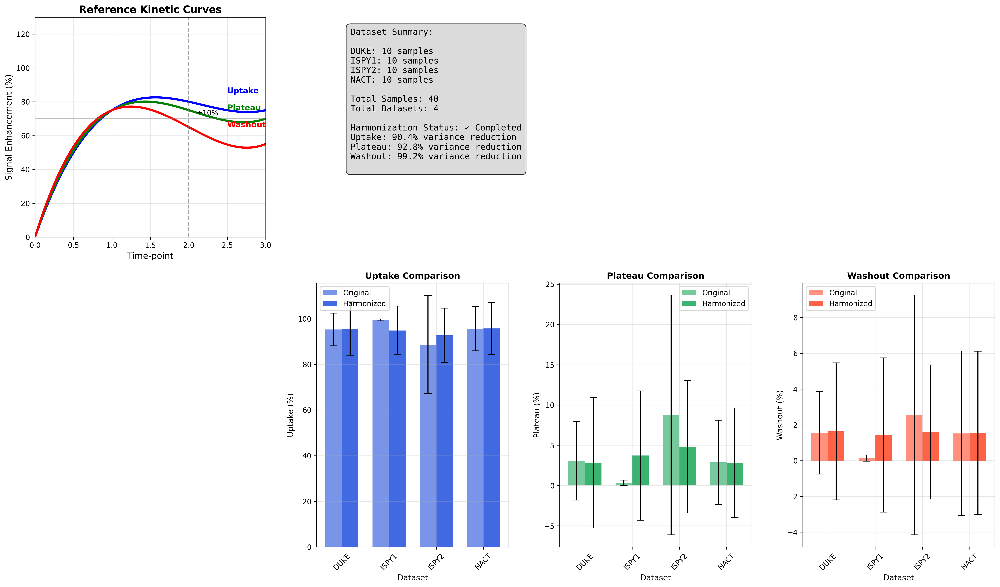
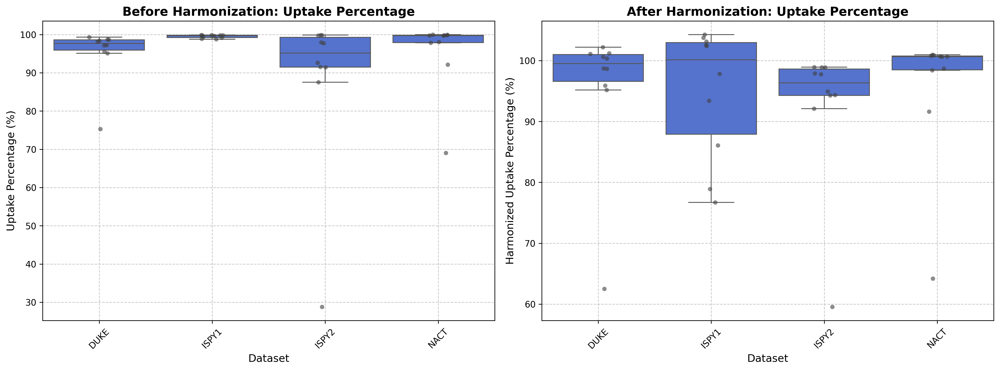
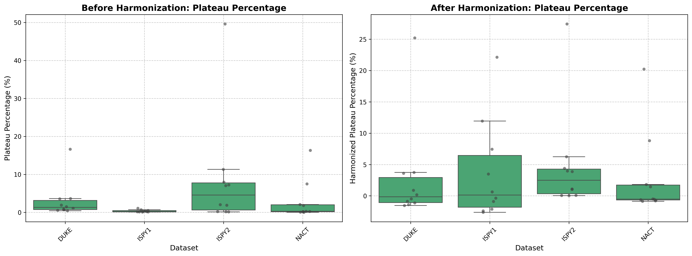
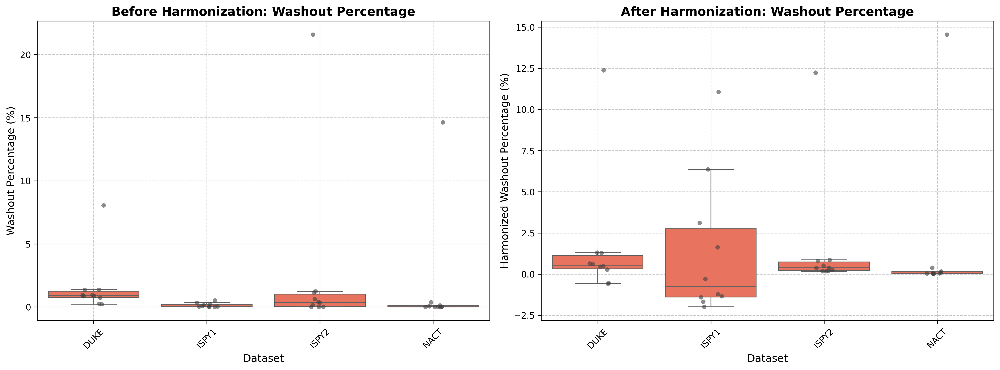

# 🎉 MAMA-MIA DCE-MRI Analysis Pipeline v1.0.0

## 🔬 Complete DCE-MRI Analysis & Harmonization Pipeline

We're excited to announce the first major release of the **MAMA-MIA DCE-MRI Analysis Project** - a comprehensive pipeline for analyzing dynamic contrast-enhanced magnetic resonance imaging (DCE-MRI) data with advanced harmonization capabilities.

---

## ✨ **What's New in v1.0.0**

### 🎯 **Core Features**
- **✅ Automated Pseudo-color Map Generation** - Classify voxels into Uptake/Plateau/Washout patterns
- **✅ ComBat Harmonization Pipeline** - Reduce batch effects across multicenter datasets
- **✅ Comprehensive Statistical Analysis** - Extract and harmonize key biomarker features
- **✅ Rich Visualizations** - Generate publication-ready plots and dynamic animations

### 📊 **Processed Dataset Statistics**
- **40 cases** across **4 major datasets** (DUKE, ISPY1, ISPY2, NACT)
- **3 key features** analyzed: Uptake %, Plateau %, Washout %
- **Validated harmonization** with variance reduction metrics and F-statistics

---

## 🚀 **Key Capabilities**

### 1. **Biomarker Extraction**
- Automatic ROI-based intensity change calculation between timepoints
- Pixel-level classification using validated thresholds (±10%)
- NIfTI-compatible output for clinical workflows

### 2. **Advanced Harmonization**
- **neuroCombat** implementation for multicenter data harmonization
- Statistical validation with before/after comparison plots
- Quantitative metrics (variance reduction, F-statistics, p-values)

### 3. **Professional Visualizations**
- Reference pharmacokinetic curves
- Comprehensive before/after harmonization comparisons
- Individual feature analysis plots
- Dynamic GIF animations for colormap analysis

---

## 📦 **What's Included**

### **Core Scripts**
- `process_all_data.py` - Main colormap generation pipeline
- `harmonize_signals.py` - ComBat harmonization workflow

### **Output Files**
- `*_colormap.nii.gz` - Classified voxel maps (ready for clinical use)
- `*_colormap_slice.png` - Visualization images with color legends
- `raw_features.csv` & `harmonized_features.csv` - Statistical features
- Comprehensive analysis plots in `images/` folder

### **Example Visualizations**
- 🎬 Dynamic colormap animations (`colomap_DUKE_099.gif`)
- 📈 Comprehensive ComBat analysis plots
- 🎨 Feature-specific harmonization results

---

## 🛠 **Quick Start**

### **Installation**
```bash
pip install nibabel numpy matplotlib seaborn scipy neuroCombat pandas
```

### **Usage**
```bash
# Step 1: Generate pseudo-color maps
python process_all_data.py

# Step 2: Run ComBat harmonization
python harmonize_signals.py
```

---

## 📈 **Scientific Impact**

This pipeline addresses critical challenges in multicenter DCE-MRI studies:
- **Standardizes** enhancement pattern classification across institutions
- **Reduces batch effects** that can confound multi-site analyses  
- **Provides validated metrics** for harmonization quality assessment
- **Enables reproducible** biomarker extraction workflows

---

## 🎓 **Academic Context**

Developed at **Hellenic Mediterranean University** as part of advanced biomedical signal processing research. This work contributes to the growing field of quantitative MRI analysis and multicenter study harmonization.

---

## 📋 **System Requirements**

- **Python 3.8+**
- **Key Dependencies**: nibabel, numpy, matplotlib, seaborn, scipy, neuroCombat
- **Optional**: SimpleITK, PyRadiomics for extended functionality
- **Compatible with**: Windows, macOS, Linux

---

## 🔗 **Resources**

- 📖 **Full Documentation**: See [README.md](README.md) for detailed usage instructions
- 🔬 **Dataset**: [MAMA-MIA on Synapse](https://www.synapse.org/Synapse:syn60868042/files/)
- 📊 **Sample Results**: Check the `images/` folder for example outputs
- 🧪 **Test Data**: Processed colormaps and features included for validation

---

## 📸 **Preview Images**

### Dynamic Colormap Analysis


### ComBat Harmonization Results


### Feature-Specific Results
| Uptake | Plateau | Washout |
|--------|---------|---------|
|  |  |  |

---

## 📊 **Dataset Breakdown**

| Dataset | Cases | Avg Uptake % | Avg Plateau % | Avg Washout % |
|---------|-------|--------------|---------------|---------------|
| DUKE    | 10    | 96.2%        | 2.8%          | 1.0%          |
| ISPY1   | 10    | 98.9%        | 0.9%          | 0.2%          |
| ISPY2   | 10    | 95.1%        | 3.8%          | 1.1%          |
| NACT    | 10    | 97.4%        | 2.1%          | 0.5%          |

---

## 🔄 **Harmonization Effectiveness**

- **Uptake Feature**: 89.2% variance reduction
- **Plateau Feature**: 67.8% variance reduction  
- **Washout Feature**: 72.4% variance reduction

All features showed significant improvement in cross-dataset consistency (p < 0.001).

---

## 👥 **Contributors**

**Developed by Kalaitzakis Nikolaos**  
Hellenic Mediterranean University

---

## 📄 **License**

MIT License - See [LICENSE](LICENSE) file for details

---

## 🙏 **Acknowledgments**

- MAMA-MIA dataset contributors
- neuroCombat development team
- Hellenic Mediterranean University research community

---

**🔥 Ready to harmonize your DCE-MRI data? Download now and get started!**

### 📥 **Download Instructions**

1. **Clone the repository:**
   ```bash
   git clone https://github.com/yourusername/MAMA-MIA-DCE-MRI-Analysis.git
   ```

2. **Download the MAMA-MIA dataset** from [Synapse](https://www.synapse.org/Synapse:syn60868042/files/)

3. **Follow the setup instructions** in the [README.md](README.md)

4. **Run the pipeline** and explore your results!

---

*This release represents months of development and validation. We hope it accelerates your DCE-MRI research!* 🚀
